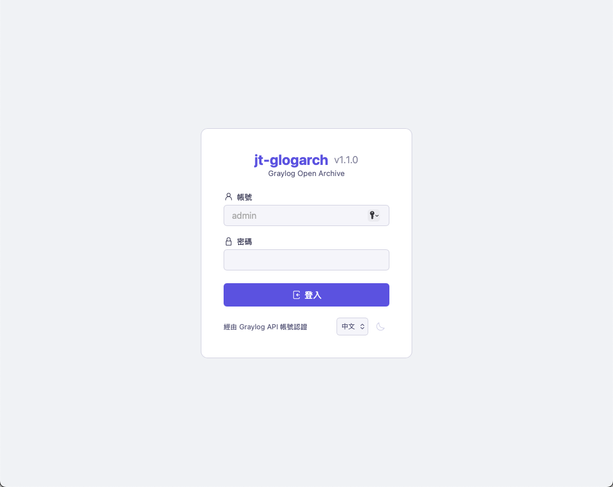
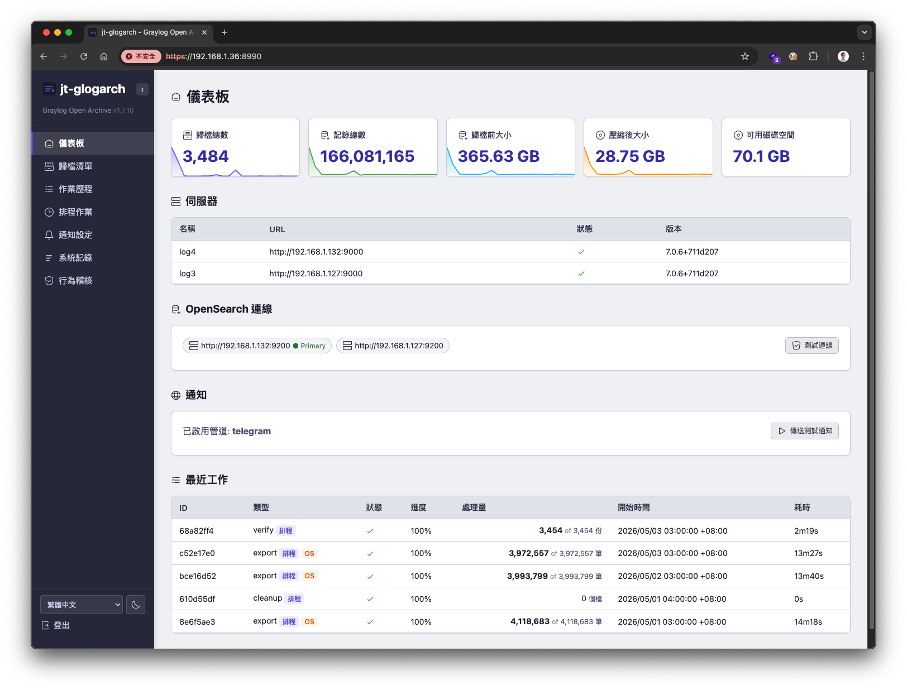
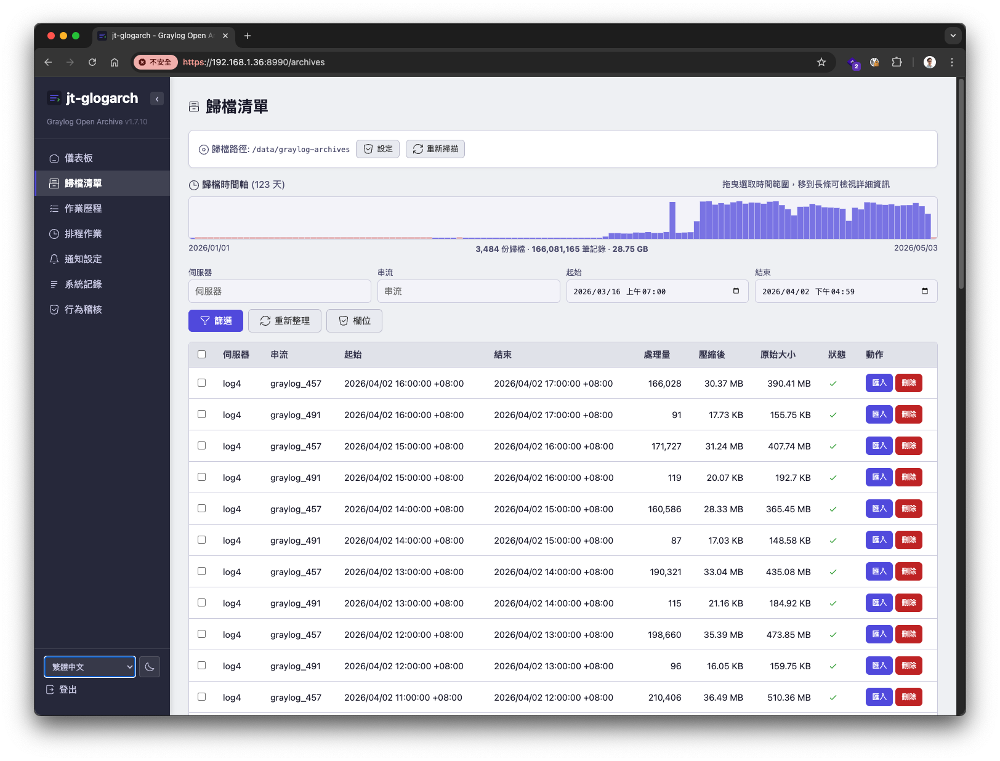
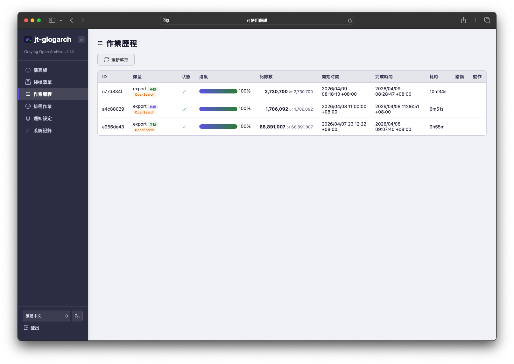
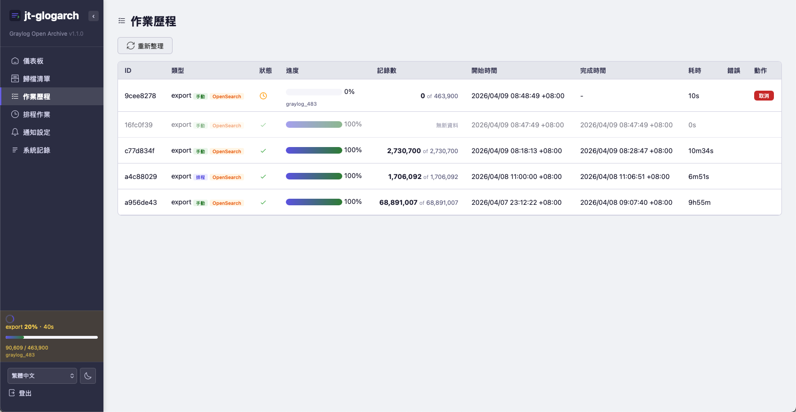
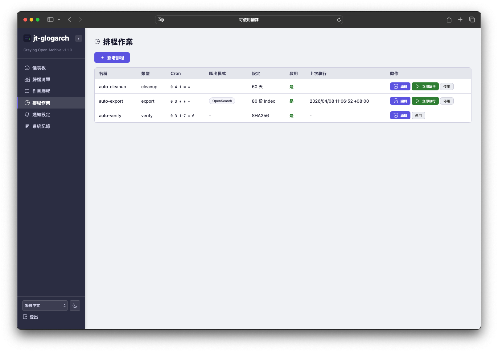
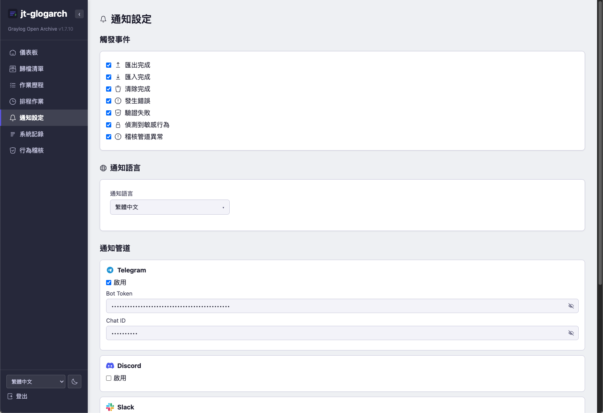
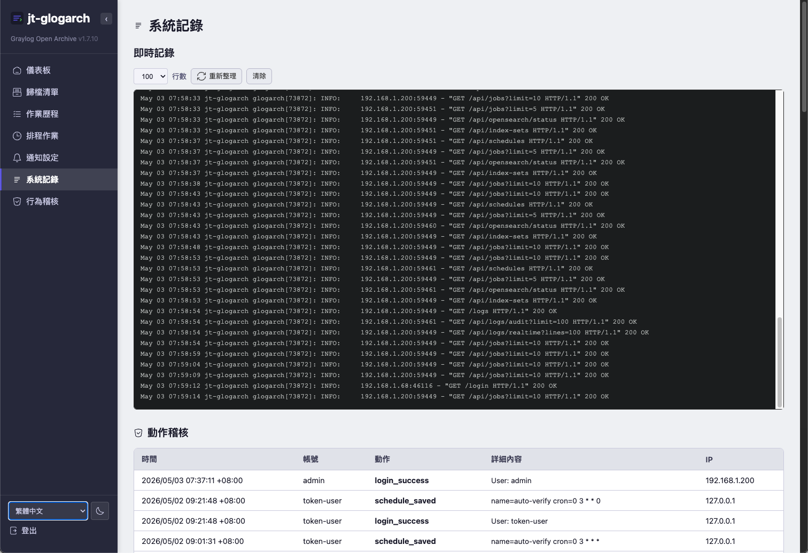
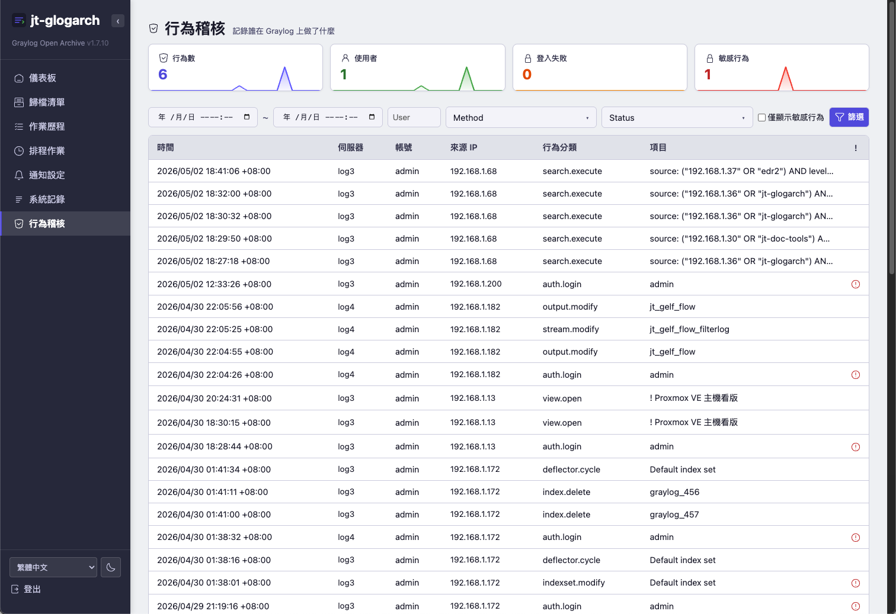
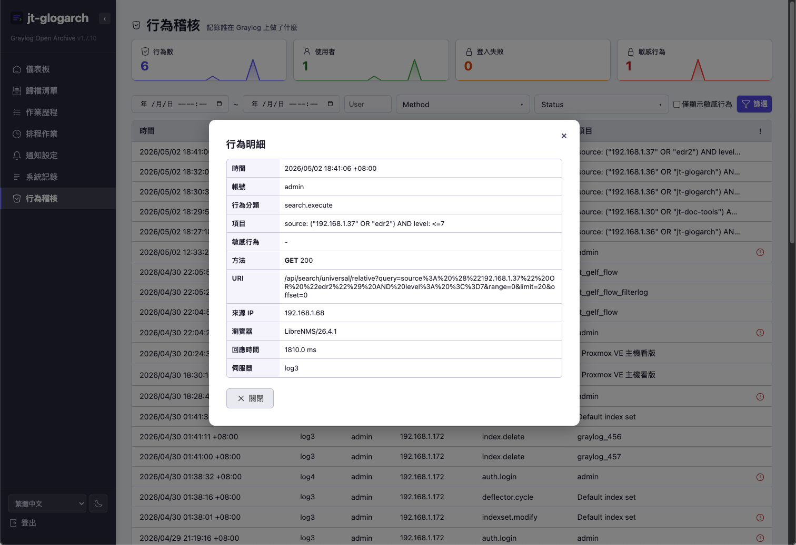

# jt-glogarch v1.7.9

**語言**: [English](README.md) | **繁體中文**

**Graylog Open Archive** — Graylog Open (6.x / 7.x) 的記錄歸檔與還原工具

[](LICENSE)
[]()
[]()

Graylog Open 版本不支援 Enterprise 版的 Archive 功能。
**jt-glogarch** 補上這個缺口，提供完整的記錄歸檔與還原工具，支援**兩種匯出模式**:

1. **Graylog REST API** — 標準方式，適用任何 Graylog Open 安裝
2. **OpenSearch Direct** — 繞過 Graylog 直接查詢 OpenSearch （約 5 倍速）

匯出的記錄會壓縮為 `.json.gz` 並有 SHA256 完整性驗證，可透過 GELF (UDP / TCP) 還原回任何 Graylog 實例。

> **作者:** Jason Cheng ([Jason Tools](https://github.com/jasoncheng7115))
> **授權:** Apache 2.0


---


## 目錄

- [功能特色](#功能特色)
- [架構與運作原理](#架構與運作原理)
- [使用情境](#使用情境)
- [快速開始](#快速開始)
  - [設定行為稽核（nginx）](#設定行為稽核nginx)
- [安裝詳細說明](#安裝詳細說明)
- [設定](#設定)
- [Web UI 使用說明](#web-ui-使用說明)
  - [儀表板](#儀表板)
  - [歸檔清單](#歸檔清單)
  - [作業歷程](#作業歷程)
  - [排程作業](#排程作業)
  - [通知設定](#通知設定)
  - [系統記錄](#系統記錄)
  - [行為稽核](#行為稽核)
- [匯入(還原)流程](#匯入還原流程)
- [效能與調校](#效能與調校)
- [CLI 指令參考](#cli-指令參考)
- [疑難排解 / 常見問題](#疑難排解--常見問題)
- [授權與作者](#授權與作者)


---


## 功能特色


### 雙模式匯出

| 功能 | Graylog API | OpenSearch Direct |
|---|---|---|
| 速度 | ~730 筆/秒 | ~3,300 筆/秒 |
| 分頁方式 | 時間視窗（突破 10K offset 限制） | `search_after` （無限制） |
| 串流篩選 | ✅ 支援 | ❌ 不支援（依 index) |
| 需要 | Graylog API Token | OpenSearch 帳密 |
| 記憶體保護 | JVM heap 監控（85% 自動停止） | 不需要 |
| 適用 | 串流篩選匯出、OpenSearch 鎖定的環境 | 大量歷史匯出、時間敏感任務 |
| Graylog 7 Data Node | ✅ 支援 | ❌ 不支援（見下方說明） |

> **Graylog 7 Data Node 使用者注意：** Data Node 環境的 OpenSearch 使用 Graylog 自動管理的 TLS 憑證認證，不對外暴露帳密，外部工具無法直接存取。因此 **OpenSearch Direct 匯出**與 **OpenSearch Bulk 匯入**在 Data Node 環境下不可用。請改用 **Graylog API 匯出**與 **GELF 匯入**。獨立安裝的 OpenSearch 不受此限制。
>
> **建議不要使用 Data Node：** 安裝 Graylog 時建議直接設定連線到獨立部署的 OpenSearch，不要使用 Data Node。這樣才能使用 OpenSearch Direct 高速匯出（約 5 倍速）和 OpenSearch Bulk 高速匯入（約 5-10 倍速）。Data Node 雖然簡化了初始安裝，但會鎖死 OpenSearch 的外部存取，嚴重限制歸檔與還原的效能。


### 智慧重複資料刪除

- **同模式重複資料刪除** — 精確比對防止重複匯出相同時間範圍
- **跨模式重複資料刪除** — 切換 API/OpenSearch 模式不會重複匯出
- **斷點續傳** — 已完成的區段絕不重做


### 歸檔管理

- **串流寫入** — 不會將所有訊息載入記憶體
- 自動分檔（預設 50MB）
- SHA256 完整性驗證（含 `.sha256` 附檔，支援 `--workers N` 平行驗證）
- 排程定期 SHA256 重新檢查
- 保留天數自動清理（含寫入中檔案保護，避免清理與匯出競態）
- 從磁碟重新掃描歸檔（偵測殘留檔案 / 遺失檔案）
- **DB 備份** — `glogarch db-backup` 線上快照，支援自動清理舊備份
- **DB 重建** — `glogarch db-rebuild` 從歸檔檔案重建 metadata DB（災難復原用）


### 匯入(還原)

兩種匯入模式（對話框中選擇）：

- **GELF (Graylog Pipeline)** — 預設。每筆訊息透過 GELF TCP/UDP 經過完整的
  Graylog input → process → indexer 處理鏈。相容 pipeline 規則、extractors、
  stream routing 與 alerts。
- **OpenSearch Bulk** — 直接透過 `_bulk` API 寫入 OpenSearch。速度快 5-10×，
  完全跳過 Graylog 處理流程。適合「原樣還原」場景。

兩種模式都會：
- 完整保留原始 `timestamp`、`source`、`level`、`facility` 及所有自訂欄位
- 在送任何資料前先跑完整的 pre-flight 合規檢查
- 匯入後對帳：零 indexer failures = 合規通過

GELF 模式還有：
- **流量控制** — 暫停/繼續、即時調整速率
- **Journal 監控** — 依目標 Graylog journal 狀態自動限速（透過 Graylog API)


### Web 管理介面

- **儀表板** — Grafana 風格的迷你圖表卡片、伺服器狀態、最近工作
- **歸檔清單** — 篩選、排序、批次操作、可拖曳選取的時間軸
- **作業歷程** — 即時進度（SSE）、耗時、取消、來源/模式標籤
- **排程作業** — Cron 編輯器、行內進度、立即執行
- **通知設定** — 6 種管道含語言選擇
- **系統記錄** — 即時記錄檢視器 + 稽核記錄
- **行為稽核** — 追蹤 Graylog 上的所有操作（誰在什麼時候做了什麼），支援篩選、敏感操作通知（60+ 種操作類型）
- 深色/淺色主題、English/繁體中文 雙語
- 可收摺側邊欄、HTTPS、Session 認證


### 通知

Telegram • Discord • Slack • Microsoft Teams • Nextcloud Talk • Email (SMTP)

觸發事件：匯出完成、匯入完成、清理完成、錯誤、驗證失敗、敏感操作、稽核警報。
雙語訊息（English / 繁體中文）。


### 排程作業 (APScheduler)

- **匯出** — Cron 排程，支援 API 或 OpenSearch 模式
- **清理** — 自動移除過期歸檔
- **驗證** — 定期 SHA256 完整性檢查
- 預設頻率（每小時、每日、每週、每月第一個週六、自訂 cron)
- 所有類型都支援「立即執行」


### 安全與效能

- **緊急本機登入** — Graylog 離線時可用 `localadmin` 帳號登入 Web UI（SHA256 hash 密碼，需預先設定。`glogarch hash-password` 產生）
- **健康檢查端點** — `GET /api/health`（免認證），回傳 DB/磁碟/排程器狀態，可供 Prometheus / Uptime Kuma 監控
- **JVM 記憶體保護** — Graylog heap > 85% 時自動暫停 API 匯出，GC 回收後自動繼續（5 分鐘未恢復才停止）
- **OpenSearch 暫態錯誤自動重試** — 500/502/503/429 自動 backoff retry
- 同伺服器並行匯出鎖定 + 同歸檔並行匯入鎖定
- 自動調節速率限制（依 CPU 使用率）
- 密碼/Token 脫敏 — 錯誤訊息自動篩除敏感資訊
- 歸檔目錄權限自動修復（root 建的目錄自動 chown）
- **`glogarch streams-cleanup`** — 清理 bulk 匯入建立的殘留 Stream / Index Set
- 執行緒安全 SQLite（WAL 模式）
- 磁碟空間監控


---


## 架構與運作原理

### 整體流程

```
+-----------------+     +------------------+     +-----------------+
|  Graylog Open   |     |   jt-glogarch    |     |  Graylog Open   |
|  (Production)   |     |                  |     |  (Query / DR)   |
|                 |     |  +------------+  |     |                 |
|  Logs --------->|---->|  | .json.gz   |  |---->|  Restored Logs  |
|                 | API |  | Archives   |  | GELF|                 |
|  OpenSearch     | or  |  | + SHA256   |  |  or |  Searchable in  |
|  Indices        | OS  |  +------------+  | Bulk|  Graylog UI     |
+-----------------+     +------------------+     +-----------------+
```

> **正式環境** Graylog 透過 API 或 OpenSearch 匯出 →
> **jt-glogarch** 壓縮歸檔（`.json.gz` + SHA256）→
> **查詢/DR 環境** Graylog 透過 GELF 或 OpenSearch Bulk 匯入還原

### 內部架構

```
+--------------------------------------------------------------------+
|                            jt-glogarch                             |
|                                                                    |
|   +-------------+         +------------------------------+         |
|   |   Web UI    | <-----> |  FastAPI + Jinja2 + JS SPA   |         |
|   |   (HTTPS)   |         +------------------------------+         |
|   +-------------+                                                  |
|                                                                    |
|   +-------------+    +-----------------+    +-------------+        |
|   |  REST API   |    |   APScheduler   |    |     CLI     |        |
|   +------+------+    +--------+--------+    +------+------+        |
|          |                    |                    |               |
|          +--------------------+--------------------+               |
|                               |                                    |
|                               v                                    |
|   +------------------------------------------------------------+   |
|   |          Export / Import / Cleanup / Verify                |   |
|   +-------+----------------+----------------+------------------+   |
|           |                |                |                      |
|           v                v                v                      |
|   +-------------+  +---------------+  +---------------+            |
|   |   SQLite    |  |   Streaming   |  |  GELF Sender  |            |
|   |     DB      |  |    Writer     |  |  (UDP / TCP)  |            |
|   +-------------+  +-------+-------+  +-------+-------+            |
|                            |                  |                    |
+----------------------------+------------------+--------------------+
                             v                  v
                    +----------------+  +----------------+
                    |    .json.gz    |  |    Graylog     |
                    | Archive Files  |  |   GELF Input   |
                    +----------------+  +----------------+
```


### 匯出流程 (Graylog API 模式)

1. 把要求的時間範圍切成每小時的區段
2. 對每個區段：
   - 已歸檔則跳過（同模式重複資料刪除）
   - 已被 OpenSearch 歸檔覆蓋則跳過（跨模式重複資料刪除）
   - 用 Graylog Universal Search 查詢（含串流篩選與時間範圍）
   - 串流寫入 gzip 檔案（不全量緩衝）
   - 計算 SHA256、寫入 `.sha256` 附檔
   - 寫入 SQLite DB
3. 定期檢查 Graylog JVM heap；>85% 自動暫停，GC 回收後繼續
4. 發送結果通知


### 匯出流程 (OpenSearch Direct 模式)

1. 列出指定 prefix 的所有 OpenSearch indices
2. 跳過 active write index
3. 篩選「最近 N 份」index（或依時間範圍）
4. 對每個 index，**單次掃描**整個 index 並依 timestamp 排序
5. 隨掃描進度將文件依小時切分成歸檔檔案
6. 每個小時檔案完成立即記錄（支援斷點續傳）
7. 發送結果通知


---


## 使用情境


### 1. 法規遵循 — 長期記錄保留

資安要求保留 1 年的認證記錄，但 Graylog Open 為了效能只設了 90 天保留期。
排程每日匯出認證 stream，讓 jt-glogarch 把超過 90 天的歸檔到便宜儲存。

> 設定：排程 → 每日 03:00 → API 模式 → 串流篩選 `authentication-stream`


### 2. 鑑識調查 — 還原過去的記錄供調查

6 個月前發生的資安事件需要調查，但相關記錄已超過 Graylog 的保留期限。在歸檔清單頁面
找到相關歸檔，點「匯入」，指向目前的 Graylog 與 GELF UDP，即可重新注入。

> 流程：歸檔清單 → 篩選時間範圍 → 選擇歸檔 → 批次匯入 → GELF UDP


### 3. 遷移 — 從舊 Graylog 叢集搬到新叢集

從舊叢集用 OpenSearch Direct 大量快速匯出，然後透過 GELF 匯入到新叢集。

> 流程：OpenSearch Direct 模式 → 依 index 匯出 → 傳輸檔案 → 匯入新 GELF


### 4. 災難復原 — 異地備份

排程每日匯出到掛載的 NFS / S3 / 雲端儲存。即使 Graylog 掛了，你還有可搜尋的歸檔。

> 設定：把遠端儲存掛載到 `/data/graylog-archives` → 排程每日匯出


### 5. 降低成本 — 減少熱儲存

OpenSearch hot tier 很貴。把舊 indices 歸檔到壓縮儲存（約 10 倍壓縮率），
OpenSearch 只保留最近的資料供搜尋。

> 設定：OpenSearch 模式 → 匯出「保留最近 30 份 index」 → 清理保留 90 天


### 6. 行為稽核 — 獨立追蹤 Graylog 上的所有操作

法規（ISO 27001、PCI-DSS、個資法等）要求保留管理者操作軌跡，但 Graylog 內建的
audit log 由 Graylog 本身管理，**具有 admin 權限者可以自行刪除或竄改**，從稽核
角度不可信。jt-glogarch 透過 nginx access log → syslog 旁路，獨立側錄所有經過
nginx 進入 Graylog 的 API 操作（建立/修改/刪除 stream、pipeline、user、search、
content pack、lookup table…等 60 種以上），存進 SQLite，**Graylog 端 admin
無權限存取此資料庫**。也支援敏感行為即時通知（多管道）與心跳偵測（nginx 轉送
中斷立即告警）。

> 設定：行為稽核頁 → 取得 nginx 設定範本 → 套用至各 Graylog 節點 → 啟用通知


---


## 快速開始


### 系統需求

- Python 3.10+
- Graylog 6.x 或 7.x (Open 版）
- OpenSearch 2.x （選用，Direct 模式需要）
- Linux （已測試 Ubuntu 22.04 / Debian 12 / RHEL 9)


### 安裝(5 分鐘)

```bash
# 1. clone 專案
sudo git clone https://github.com/jasoncheng7115/jt-glogarch.git /opt/jt-glogarch
cd /opt/jt-glogarch

# 2. 執行安裝指令碼(建立使用者、目錄、SSL 憑證、systemd 服務)
sudo bash deploy/install.sh

# 3. 編輯設定檔填入 Graylog 資訊
sudo vi /opt/jt-glogarch/config.yaml

# 4. 啟動服務
sudo systemctl enable --now jt-glogarch

# 5. 開啟 Web UI
echo "Open: https://$(hostname):8990"
```

使用 Graylog 帳號登入。


### 設定行為稽核（nginx）

jt-glogarch 內建行為稽核功能，可追蹤誰在 Graylog 上做了什麼操作。原理是接收各 Graylog 伺服器上 nginx 反向代理的存取記錄。**預設已啟用** — 只需設定 nginx 即可。

> 如果不需要行為稽核功能，可跳過此段。

**在每一台 Graylog 伺服器上**，安裝並設定 nginx 作為反向代理：

```bash
# 1. 安裝 nginx（如已安裝可跳過）
sudo apt install -y nginx

# 2. 建立 SSL 憑證（如已有可跳過）
sudo openssl req -x509 -newkey rsa:2048 -nodes \
    -keyout /etc/ssl/private/graylog.key \
    -out /etc/ssl/certs/graylog.crt \
    -days 3650 -subj "/CN=$(hostname)"

# 3. 在 /etc/nginx/nginx.conf 中加入稽核記錄格式
#    放在 http { } 區塊內，所有 "include" 之前：
```

```nginx
    log_format graylog_audit escape=json
            '{'
            '"time":"$time_iso8601",'
            '"remote_addr":"$remote_addr",'
            '"method":"$request_method",'
            '"uri":"$uri",'
            '"args":"$args",'
            '"status":$status,'
            '"body_bytes_sent":$body_bytes_sent,'
            '"request_body":"$request_body",'
            '"http_authorization":"$http_authorization",'
            '"http_cookie":"$cookie_authentication",'
            '"user_agent":"$http_user_agent",'
            '"request_time":$request_time,'
            '"server_name":"$server_name"'
            '}';
```

```bash
# 4. 建立 Graylog 站台設定檔：/etc/nginx/sites-available/graylog
```

```nginx
server {
        listen 443 ssl;
        server_name graylog.example.com;

        ssl_certificate /etc/ssl/certs/graylog.crt;
        ssl_certificate_key /etc/ssl/private/graylog.key;

        location / {
                proxy_pass http://127.0.0.1:9000/;
                proxy_http_version 1.1;
                proxy_set_header Host $host;
                proxy_set_header X-Real-IP $remote_addr;
                proxy_set_header X-Forwarded-For $proxy_add_x_forwarded_for;
                proxy_set_header X-Graylog-Server-URL https://$host/;
                proxy_pass_request_headers on;
                proxy_buffering off;
                client_max_body_size 8m;
        }

        # 行為稽核 — 將存取記錄傳送至 jt-glogarch
        access_log syslog:server=JT_GLOGARCH_IP:8991,facility=local7,tag=graylog_audit graylog_audit;
        client_body_buffer_size 64k;
}

# 選用：HTTP 自動轉導至 HTTPS
server {
        listen 80;
        return 301 https://$host$request_uri;
}
```

```bash
# 5. 將上述設定中的 JT_GLOGARCH_IP 替換為 jt-glogarch 伺服器的實際 IP

# 6. 啟用站台並測試
sudo ln -sf /etc/nginx/sites-available/graylog /etc/nginx/sites-enabled/
sudo nginx -t && sudo systemctl reload nginx

# 7. 在 jt-glogarch 伺服器上開放 UDP 8991 連接埠
#    （在 jt-glogarch 伺服器上執行，不是 Graylog 伺服器）
sudo ufw allow 8991/udp

# 8. 重要：封鎖外部直接存取 Graylog 的 9000 連接埠
#    只允許 localhost（nginx）及其他 Graylog 叢集節點。
#    這樣可強制所有使用者經由 nginx 存取，確保完整的稽核涵蓋率。
#    將 CLUSTER_NODE_IP 替換為你叢集中每台 Graylog 節點的 IP。
sudo ufw deny 9000
sudo ufw allow from 127.0.0.1 to any port 9000
sudo ufw allow from CLUSTER_NODE_IP to any port 9000
# 對叢集中的每台 Graylog 節點重複上面這行
```

設定完成後，開啟 jt-glogarch Web UI → **行為稽核** 頁面，確認資料正常流入。

> **重要事項：**
> - `log_format` 區塊必須放在 `nginx.conf` 中 `include` 行**之前**
> - 將 `JT_GLOGARCH_IP` 替換為 jt-glogarch 伺服器的實際 IP
> - 將 `CLUSTER_NODE_IP` 替換為每台 Graylog 叢集節點的 IP
> - **必須封鎖 9000 連接埠的外部存取** — 如果使用者可以繞過 nginx，其操作將不會被稽核
> - 若為 Graylog 叢集，需在**每一台** Graylog 節點上重複步驟 3-8
> - 封鎖 9000 連接埠後，請改用 `https://<hostname>`（443 連接埠）存取 Graylog
> - 完整的操作追蹤清單請參閱 [AUDIT-OPERATIONS.md](AUDIT-OPERATIONS.md)


---


## 安裝詳細說明


### 手動安裝

如果你不想用 `install.sh`:

```bash
# 1. 安裝 Python 依賴
pip install --no-build-isolation --no-cache-dir /opt/jt-glogarch

# 2. 建立系統使用者
useradd -r -s /bin/false -d /opt/jt-glogarch jt-glogarch

# 3. 建立歸檔儲存目錄
mkdir -p /data/graylog-archives
chown -R jt-glogarch:jt-glogarch /data/graylog-archives

# 4. 產生自簽 SSL 憑證
mkdir -p /opt/jt-glogarch/certs
openssl req -x509 -newkey rsa:4096 -nodes \
  -keyout /opt/jt-glogarch/certs/server.key \
  -out /opt/jt-glogarch/certs/server.crt \
  -days 3650 -subj '/CN=jt-glogarch'

# 5. 複製設定範本
cp /opt/jt-glogarch/deploy/config.yaml.example /opt/jt-glogarch/config.yaml
chown jt-glogarch:jt-glogarch /opt/jt-glogarch/config.yaml

# 6. 安裝 systemd 服務
cp /opt/jt-glogarch/deploy/jt-glogarch.service /etc/systemd/system/
systemctl daemon-reload
systemctl enable --now jt-glogarch
```


### 驗證安裝

```bash
# 服務狀態
systemctl status jt-glogarch

# 即時日誌
journalctl -u jt-glogarch -f

# 測試 Web UI（應回傳 HTTP 200）
curl -sk https://localhost:8990/login -o /dev/null -w '%{http_code}\n'

# 健康檢查（應回傳版本號 + healthy）
curl -sk https://localhost:8990/api/health
```


### 升級

GitHub 上有新版本時，一行指令完成升級：

```bash
sudo bash /opt/jt-glogarch/deploy/upgrade.sh
```

升級指令碼會自動：備份 DB → git pull → pip install → 重啟服務 → 確認版本。

> - `config.yaml` 和 `jt-glogarch.db` 不會被覆蓋（git 不追蹤）
> - 新版若有新設定欄位會自動使用預設值，不需手動加
> - DB schema 會在服務啟動時自動升級（`_migrate()`）
> - 建議升級後檢查 [CHANGELOG](CHANGELOG-zh_TW.md) 確認是否有需要注意的變更


---


## 設定

設定檔在 `/opt/jt-glogarch/config.yaml`，**檔案擁有者必須是 `jt-glogarch`**。

安裝後只需填寫 Graylog 連線資訊即可啟動，其餘設定都可在 Web UI 完成。

```yaml
# === 必填：Graylog 連線 ===
servers:
  - name: log4
    url: "http://你的GRAYLOG_IP:9000"
    auth_token: "你的_GRAYLOG_API_TOKEN"

default_server: log4

# === 必填：歸檔存放路徑 ===
export:
  base_path: /data/graylog-archives

# === 選填：OpenSearch 直連模式（不用可不填）===
opensearch:
  hosts:
    - "http://你的OS_IP:9200"
  username: admin
  password: "你的_OS_密碼"

# === 選填：DB 路徑（預設即可）===
database_path: /opt/jt-glogarch/jt-glogarch.db
```

> 排程、通知、匯入、保留策略等設定都可在 Web UI 的「排程作業」和「通知設定」頁面完成。
> 完整設定參考請見 [CONFIG-zh_TW.md](CONFIG-zh_TW.md) 或 [`deploy/config.yaml.example`](deploy/config.yaml.example)。


---


## Web UI 使用說明

Web UI 是**主要操作介面**，CLI 用於自動化和指令碼。

登入使用您的 Graylog 帳號密碼 — 沒有獨立的使用者資料庫，身份驗證委派給 Graylog REST API。




### 儀表板



首頁顯示五個關鍵統計卡片（含 sparkline):

| 卡片 | 顯示內容 |
|---|---|
| **歸檔總數** | 已完成的歸檔檔案數量 |
| **記錄總數** | 已歸檔的記錄總筆數 |
| **歸檔前大小** | 壓縮前的總大小 |
| **壓縮後大小** | 磁碟上的總大小（gzip 後） |
| **可用磁碟空間** | 歸檔磁區的剩餘空間 |

每張卡片背後的 sparkline 顯示最近 30 天的每日活動。
滑鼠移到任一長條可看該日的精確數值。

下方區塊：
- **伺服器** — 已連接的 Graylog 伺服器與狀態
- **OpenSearch** — 連線測試狀態（右鍵點主機可設為 primary)
- **通知** — 已啟用的通知管道與「傳送測試通知」按鈕
- **最近工作** — 最近 5 個工作含進度、來源/模式標籤、耗時


### 歸檔清單



這是管理所有歸檔的地方。

**頂部區域：**
- **歸檔路徑** — 目前儲存位置，有「設定」（變更路徑）和「重新掃描」（從磁碟同步）
- **歸檔時間軸** — 顯示所有歸檔的每日分布圖
  - 長條高度 = 該日記錄數
  - **拖曳**選取時間範圍（精確到小時） — 自動填入篩選並套用
  - **滑鼠移到**任一欄位可看日期、歸檔數、記錄數、檔案大小
  - 紅色標記 = 該日無歸檔（資料缺口）
  - 點**清除選取**重設

**篩選：** 伺服器、串流、起始、結束。點「篩選」套用。

**表格：**
- 可排序欄位（伺服器端排序，跨頁保持）
- **批次選取** — 用核取方塊，Shift+全選可跨頁批次
- **每列動作：** 匯入（單筆）、刪除

**批次動作**（勾選列後出現）：
- **批次匯入** — 開啟匯入 modal 含 GELF 設定 + 流量控制
- **批次刪除** — 從磁碟移除檔案並標記為已刪除

**欄位設定** — 可開關欄位顯示（存在 localStorage)


### 作業歷程




顯示所有匯出、匯入、清理、驗證作業。

| 欄位 | 說明 |
|---|---|
| ID | Job UUID 前 8 碼 |
| 類型 | export / import / cleanup / verify 含標籤（手動/排程，API/OpenSearch) |
| 狀態 | running / completed / failed / cancelled |
| 進度 | 行內進度條 + 百分比；執行中顯示目前 chunk/index |
| 記錄數 | 已完成/總數（粗體+灰色總數） |
| 開始時間 | 工作開始時間 |
| 完成時間 | 工作結束時間 |
| 耗時 | 執行時間 |
| 錯誤 | 失敗時的錯誤訊息 |
| 動作 | 執行中工作的取消按鈕 |

完成時記錄數為 **0** 的工作會以淡色顯示「無新資料」 — 排程匯出在沒有新累積資料時是正常現象。


### 排程作業



管理自動化工作。支援三種類型：

#### 匯出排程

```
名稱:     auto-export
類型:     Export
頻率:     Daily 03:00
模式:     OpenSearch Direct
保留:     最近 60 份 Index   ← API 模式則為「天數」
```

OpenSearch 模式可選擇**保留最近 N 份 index**。下方的「可用 indices」時間軸顯示
目前存在的 index（及作為 active write index 的那一份，永遠排除）。

#### 清理排程

```
名稱:     auto-cleanup
類型:     Cleanup
頻率:     每月 1 號 04:00
保留天數:  1095 天
```

刪除超過保留天數的歸檔檔案並更新 DB。

#### 驗證排程

```
名稱:     auto-verify
類型:     Verify
頻率:     每月第一個週六 03:00
```

重新驗證所有歸檔的 SHA256 校驗碼。校驗失敗的會在 DB 標記為**損毀**，在歸檔清單以紅色警告 icon 顯示。

**立即執行按鈕** — 所有排程類型都支援手動立即執行。
匯出工作的行內進度會直接顯示在排程列上。


### 通知設定



設定通知要送到哪裡。

**通知語言** — 可選 English 或繁體中文。會套用到**所有**通知訊息（測試通知、匯出完成、錯誤等）。

**觸發事件** — 勾選哪些事件要發送通知：
- 匯出完成
- 匯入完成
- 清理完成
- 錯誤
- 驗證失敗
- 敏感操作（行為稽核 — 刪除使用者、認證服務變更等）
- 稽核警報（行為稽核 — 超過 10 分鐘未收到 syslog）

**通知管道** — 設定每個管道。**取消勾選「啟用」**會自動收摺該管道的設定欄位，讓頁面更整潔。

> **欄位敏感資料遮罩:** 所有敏感欄位（Bot Token、Chat ID、Webhook URL、
> Nextcloud token / 帳號 / 密碼、SMTP host / 帳號 / 密碼 等）預設以遮罩顯示
> 為密碼欄位。點擊欄位右側的眼睛按鈕可暫時顯示內容。瀏覽器自動填入功能也已
> 在這些欄位上停用，避免不小心被填入舊值。

| 管道 | 必填欄位 |
|---|---|
| Telegram | Bot Token、Chat ID |
| Discord | Webhook URL |
| Slack | Webhook URL |
| Microsoft Teams | Webhook URL |
| Nextcloud Talk | Server URL、Token、Username、Password |
| Email (SMTP) | Host、Port、TLS、User、Password、From、To |

點**傳送測試通知**驗證所有已啟用的管道。測試訊息會以設定的語言發送。


### 系統記錄



即時 tail `journalctl -u jt-glogarch` 加上稽核記錄（登入、匯出開始、設定儲存等）。


### 行為稽核



追蹤 Graylog 上的所有操作 — 獨立於 Graylog 的合規等級稽核。

**主要特點：**
- 記錄完整 request body — 可以看到改了什麼設定、搜尋了什麼 query、建帳號的完整內容
- 稽核記錄獨立存放 — 管理員無法刪除自己的操作記錄

**運作原理：**
- 每台 Graylog 上的 nginx 透過 UDP syslog 送出 JSON 存取記錄到 jt-glogarch（port 8991）
- jt-glogarch 接收、解析、分類為 60+ 種操作類型、解析使用者名稱、存入 SQLite
- IP 允許清單自動從 Graylog Cluster API 取得 — 零設定
- 只記錄有意義的操作；背景輪詢、靜態資源、指標數據自動過濾

**頁面佈局：**

1. **狀態列** — Listener 狀態（運行中/停用）、UDP 埠號、最後收到時間、記錄筆數、保留天數、心跳警報
2. **統計卡片**（最近 24h）— 總操作數、不重複使用者、登入失敗數、敏感操作數，附迷你趨勢圖
3. **篩選列** — 時間範圍、使用者、HTTP 方法、URI 模式、狀態碼、僅顯示敏感操作
4. **結果表格** — 時間、伺服器、使用者、方法（色碼標記）、URI、狀態碼（色碼）、操作分類、項目名稱（人類可讀的資源名稱）、敏感標記
5. **明細 Modal** — 點擊任一列可查看完整明細，包含格式化的 JSON request body（語法上色）及複製按鈕
6. **設定區** — nginx 設定範本（含複製按鈕）、listener 開關



**帳號解析：**

| 方式 | 說明 |
|------|------|
| Basic Auth | 從 `Authorization` header 取出使用者名稱 |
| Token Auth | 透過 Graylog 使用者 Token API 解析，以 token 開頭字元快取 |
| Session Auth | 從 `Authorization` header 取出 session ID，透過 Graylog Sessions API 解析 |
| Cookie Session | 從 nginx log 中的 `$cookie_authentication` cookie 取出 session ID |
| IP 快取 | 以用戶端 IP 對應最後已知使用者 |
| 單一使用者 | 僅有一個人類帳號時自動歸屬 |

**項目名稱解析：**

URI 中的資源 ID 自動透過 Graylog API 快取解析為人類可讀名稱（每 6 分鐘重新整理）：
inputs、streams、index sets、dashboards/views、pipelines、pipeline rules、event definitions、event notifications、lookup tables/adapters/caches、content packs、authentication services、outputs、users、roles。

**敏感操作警報：**

啟用 `op_audit.alert_sensitive` 時，敏感操作（刪除使用者、刪除 stream、認證服務變更、系統關機等）會透過所有已設定的通知管道發送警報。

**心跳監控：**

若 listener 正在運行且 Graylog 可達，但超過 10 分鐘未收到 syslog，將觸發警報 — 表示稽核流程出現無聲故障（如 nginx 設定錯誤、網路問題）。

**設定：**
```yaml
op_audit:
  enabled: true          # 預設啟用
  listen_port: 8991      # UDP syslog 埠號
  retention_days: 180    # 獨立於歸檔保留期限（預設 180 天）
  max_body_size: 65536   # 最大存入的 request body 大小（64KB）
  alert_sensitive: true  # 敏感操作發送警報
```

**保留策略：** 稽核記錄由排程清理作業自動清除。`op_audit.retention_days`（預設 180 天）與歸檔保留策略（預設 1095 天）獨立。預估儲存空間：每筆約 2 KB，每日 1000 筆操作每年約 360 MB。

> 完整的 60+ 種操作類型清單請參考 [AUDIT-OPERATIONS-zh_TW.md](AUDIT-OPERATIONS-zh_TW.md)。
>
> nginx 設定說明請參考[快速開始 — 設定行為稽核](#設定行為稽核nginx)。


---


## 匯入(還原)流程

匯入流程圍繞「**合規流程**」設計，目標是 **零訊息遺失 + 零 indexer failures**。
所有保護措施都在送任何 GELF 訊息**之前**自動執行：

1. **Cluster health check** — 對方 OpenSearch 是 RED 直接拒絕匯入
2. **GELF input 驗證** — 必須存在於指定 port 且為 RUNNING 狀態
3. **Capacity check** — 用對方 rotation strategy 估算這次匯入會建立幾份
   index；如果**刪除型 retention 會把剛匯入的資料刪掉**直接 abort
4. **欄位 mapping 衝突自動修正** — 從 DB 讀每份歸檔記錄好的 `field_schema`，
   找出歸檔內部矛盾（同欄位有 numeric 和 string）或對方目前是 numeric 而歸檔
   有字串值的欄位，**透過 Graylog custom field mappings API 自動把這些欄位
   pin 為 `keyword`**
5. **OpenSearch 欄位上限突破** — 自動 PUT 一個 OpenSearch index template 把
   `index.mapping.total_fields.limit` 拉到 10000，徹底解決套用大量 custom
   mappings 時撞到 Graylog 預設 1000 欄位上限導致 index rotation 失敗的問題
6. **Index rotation** — cycle deflector 一次，讓新 mappings 在新的 active
   write index 上生效
7. **GELF send** — 用 TCP backpressure + Graylog journal 監控（對方
   uncommitted entries > 50 萬時自動暫停）
8. **匯入後對帳** — 撈 Graylog indexer failures 數字跟匯入前 baseline 比對，
   差異 > 0 就把 compliance violation 訊息寫進 job 的 `error_message`

### 必填:目標 Graylog API 帳密

從 v1.3.0 開始，匯入對話框**必填** Graylog API URL + Token（或帳號/密碼）。
同一組帳密同時用於 preflight、journal 監控、與對帳。**沒有「不監控」這個
選項了**。

### 兩種匯入模式(v1.3.0 起)

匯入對話框上方有**模式選擇器**:

| 模式 | 速度 | 經過 | 適用情境 |
|---|---|---|---|
| **GELF (Graylog Pipeline)**（預設） | ~5,000 筆/秒 | Graylog Input → Process buffer → Output buffer → OpenSearch | 你需要 Graylog 規則（pipeline、extractors、stream routing、alerts）在匯入資料上跑 |
| **OpenSearch Bulk** | ~30,000-100,000 筆/秒 | 直接 OpenSearch `_bulk` API | 還原已處理過的歷史資料，要最快速度 |

**Bulk 模式取捨：**
- ✅ **5-10 倍速度**（沒有 GELF framing、沒有 Graylog journal 寫入磁碟、沒有 buffer 壓力）
- ✅ **每筆精確對帳**從 `_bulk` response（不依賴 Graylog 的 circular failure buffer)
- ✅ **不會誤觸 alert**（訊息不經過 stream routing)
- ❌ **跳過所有 Graylog 處理規則** — pipeline、extractors、stream routing、alerts。資料原樣從歸檔進到 OpenSearch。
- ❌ **需要 OpenSearch 帳密**（預設會自動偵測）。

**Bulk 匯入的資料寫到哪：**
- Bulk 模式寫進**專屬 index pattern**（預設 `jt_restored_*`），不是即時的
  `graylog_*` index。讓還原資料跟即時流量完全隔離。
- 每個 daily index 命名 `<pattern>_YYYY_MM_DD`，依訊息 timestamp 決定。
- Preflight 階段 jt-glogarch 會自動：
  1. 寫一個 OpenSearch index template `<pattern>_*`，設
     `total_fields.limit: 10000` 並把所有字串型欄位 pin 為 `keyword`
  2. 預先建立每個 daily index(Graylog 環境的 OpenSearch 通常設
     `action.auto_create_index = false`)
  3. **自動建立 Graylog Index Set** 對應這個 prefix，還原資料立刻可在
     Graylog UI 上搜尋。不需手動到「System / Indices」設定。

**重複資料刪除機制：**
- 歸檔保留的 `gl2_message_id` 會被 bulk 模式拿來當 OpenSearch 文件 `_id`。
  重複匯入同一份歸檔會 overwrite 既有文件，不會產生重複。
- 也可以選 `不重複資料刪除`（允許重複）或 `偵測到重複就中止` 兩種策略。


### 步驟 1 — 選擇歸檔

進入**歸檔清單**，可選擇性地依時間範圍或串流篩選，然後勾選歸檔。點**批次匯入**。


### 步驟 2 — 設定 GELF 目標

```
GELF Host:    192.168.1.132
Port:         32202   ← TCP 預設值;切換到 UDP 會自動變成 32201
Protocol:     TCP   ← 預設。可靠,有 backpressure
              UDP   ← 較快但 buffer 滿時會丟封包
目標名稱:      log-recovery
```

> Port 欄位會跟著 Protocol 自動切換（TCP → 32202、UDP → 32201）。如果你
> 手動改過 port，你的值會被保留。請確認目標 Graylog 有設定對應的 GELF
> Input 監聽這些 port。

> **⚠️ UDP vs TCP — 重要警告:**
> - **TCP（建議，預設）：** 有內建 backpressure。當目標 Graylog input buffer 滿
>   時，TCP 寫入會自然暫停傳送，jt-glogarch 會跟著降速，**不會掉訊息**。吞吐量
>   約 1,000~3,000 筆/秒。
> - **UDP（不建議用於大量匯入）：** 較快（~5,000~10,000 筆/秒）但 buffer 滿時
>   會**無聲地丟掉封包**，jt-glogarch 完全收不到任何錯誤回報 — `messages_done`
>   會說「我送了 X 筆」，但目標 Graylog 可能只收到一部分。症狀：匯入後的時間
>   軸會看到一段一段空白。**百萬筆等級的匯入若沒有流量控制，UDP 損失率常見
>   20-30%。**
>
> 即使使用 UDP，Journal 監控（透過 Graylog API）永遠開啟，當對方未處理的
> journal entries 超過 50 萬時會自動降速。但 UDP 在初始衝量時還是無法完全
> 避免丟封包。


### 步驟 3 — 設定初始速率

用**批次延遲（ms)** 滑桿設定批次之間的等待時間。
- 5-50ms = 積極（僅在有監控時使用）
- 100ms = 平衡預設值
- 500-1000ms = 保守


### 步驟 4 — 提供目標 Graylog API 帳密(必填)

從 v1.3.1 開始**必填**。同一組帳密用於 preflight、journal 監控、匯入後對帳。

```
Graylog API URL:  http://192.168.1.132:9000
API Token:        你的_TOKEN          ← 用 Token...
   — 或 —
帳號:            admin                ← ...或帳號 + 密碼
密碼:            ******
```

> 沒填這些對話框不會讓你按開始匯入。後端也會回 HTTP 400 拒絕。


### 步驟 5 — 開始與監控

點**開始匯入**後，modal 切換到控制面板：

- **暫停 / 繼續** — 暫停匯入而不丟失進度
- **速率滑桿** — 即時調整延遲，不需重啟
- **Journal 標籤** — 顯示目前 Graylog journal 狀態：
  - 🟢 normal — 全速
  - 🟡 slow — uncommitted entries 10萬-50萬，延遲加 3 倍
  - 🟠 paused — uncommitted entries 50萬-100萬，自動暫停 30 秒
  - 🔴 stop — uncommitted entries >100萬，中止匯入並通知管理員


### 自動限速規則

| Journal `uncommitted_entries` | 動作 |
|---|---|
| < 100,000 | 正常速度（你設定的延遲） |
| 100,000 — 500,000 | 慢速模式（延遲 × 3) |
| 500,000 — 1,000,000 | 暫停 30 秒 |
| > 1,000,000 | 停止匯入並發送通知 |


---


## 效能與調校


### Benchmark(預設設定)

| 模式 | batch_size | delay | 速度 | 1 小時（~175K 筆） |
|---|---|---|---|---|
| Graylog API | 1,000 | 5ms | ~730 筆/秒 | ~4 分鐘 |
| OpenSearch Direct | 10,000 | 2ms | ~3,300 筆/秒 | ~1 分鐘 |


### 何時用哪種模式

**用 Graylog API 模式當：**
- 需要串流層級的篩選
- OpenSearch 已鎖定（無直接存取權）
- 想要 JVM 記憶體保護（85% heap 自動停止）

**用 OpenSearch Direct 模式當：**
- 需要快速大量匯出歷史資料
- 有 OpenSearch 帳密
- 想要 index 層級的粒度


### 調校建議

**Graylog API 模式** — 如果你的 Graylog 叢集有充裕資源：
```yaml
export:
  batch_size: 2000              # 預設 1000
  delay_between_requests_ms: 0  # 預設 5ms
  jvm_memory_threshold_pct: 90.0
```
> ⚠️ 注意 JVM 記憶體保護 — 如果 Graylog OOM，降低這些值。

**OpenSearch Direct 模式** — 預設值已經很積極。如果 OpenSearch 機器很強，可以推到 batch_size 20000+。


---


## CLI 指令參考

CLI 提供給自動化和指令碼使用。Web UI 才是日常操作的主要介面。

```bash
glogarch --help
```

| 指令 | 說明 |
|---|---|
| `glogarch server` | 啟動 Web UI + 排程器 (systemd 跑的就是這個） |
| `glogarch export` | 手動匯出 (`--mode api|opensearch --days 180`) |
| `glogarch import` | 匯入歸檔 (`--archive-id N --target-host HOST`) |
| `glogarch list` | 列出歸檔（支援篩選） |
| `glogarch verify` | 驗證所有歸檔的 SHA256 |
| `glogarch cleanup` | 移除過期歸檔 |
| `glogarch status` | 顯示系統狀態 |
| `glogarch schedule` | 管理排程作業 |
| `glogarch config` | 印出設定範本 |


### 範例:CLI 一次性匯出

```bash
sudo -u jt-glogarch glogarch export \
  --mode opensearch \
  --days 30
```


### 範例:從 CLI 還原歸檔

```bash
sudo -u jt-glogarch glogarch import \
  --archive-id 42 \
  --target-host 192.168.1.132 \
  --target-port 12201
```


---


## 疑難排解 / 常見問題


### 寫入 `/data/graylog-archives/` 出現「Permission denied」

服務以 `jt-glogarch` 使用者執行。確認歸檔目錄擁有者：
```bash
sudo chown -R jt-glogarch:jt-glogarch /data/graylog-archives
```


### Web UI 顯示「Not authenticated」但我剛登入

自簽憑證問題。瀏覽器可能拒絕了 cookie。試試：
1. 點 SSL 警告的「進階」→「繼續前往網站」
2. 用無痕視窗開
3. 或用 Let's Encrypt 換真憑證


### Pip install 顯示 `Successfully installed UNKNOWN-0.0.0`

舊的 `setuptools` 無法讀取 `pyproject.toml` metadata。修法：
```bash
pip install --upgrade setuptools wheel
rm -rf /opt/jt-glogarch/build /opt/jt-glogarch/*.egg-info
pip install --no-build-isolation --no-cache-dir --force-reinstall /opt/jt-glogarch
```


### 排程作業沒有在預期時間執行

`jt-glogarch` 使用 APScheduler，而 APScheduler **會繼承系統時區**。如果你的
系統時區是 UTC，但你寫的 cron 是 `0 3 * * *` 並期待「每天台灣時間凌晨 3 點」
執行，實際上會在 UTC 03:00 觸發（也就是台灣時間早上 11 點）。

**檢查系統時區：**
```bash
timedatectl
```

**設成本地時區：**
```bash
sudo timedatectl set-timezone Asia/Taipei
sudo systemctl restart jt-glogarch
```

重啟後 scheduler 會自動讀到新時區。可用以下指令確認下次觸發時間：
```bash
python3 -c '
from apscheduler.triggers.cron import CronTrigger
from apscheduler.schedulers.asyncio import AsyncIOScheduler
from datetime import datetime
s = AsyncIOScheduler()
print("scheduler tz:", s.timezone)
t = CronTrigger.from_crontab("0 3 * * *", timezone=s.timezone)
print("next fire:", t.get_next_fire_time(None, datetime.now(s.timezone)))
'
```


### OpenSearch 模式排程匯出顯示「0 筆」

最有可能是 resume point 跳過了你的 indices。這已在 v1.0.0 修復 — OpenSearch 模式現在依靠 per-chunk dedup 而非 resume point 來避免缺口。確認你的版本 ≥ 1.0.0。


### API 匯出因 JVM heap 壓力暫停或停止

使用 API 模式時，jt-glogarch 會監控 Graylog 的 JVM heap 使用率。heap 超過閾值（預設 85%）時，匯出會**自動暫停**，最多等待 5 分鐘讓 GC 回收。heap 降回閾值以下就自動繼續。等了 5 分鐘仍未降低才會停止。

**方案 1 — 降低查詢壓力**（不需重啟 Graylog）：
```yaml
export:
  batch_size: 300                        # 預設 1000 — 降低 = 每次查詢佔用更少 heap
  delay_between_requests_ms: 100         # 預設 5 — 加大 = 給 GC 更多時間回收
```

**方案 2 — 加大 Graylog heap**（伺服器有 ≥16 GB RAM 時建議）：
```bash
# 編輯 /etc/default/graylog-server（或 graylog-server.conf）
GRAYLOG_SERVER_JAVA_OPTS="-Xms8g -Xmx8g"
sudo systemctl restart graylog-server
```

8 GB heap 在 85% 閾值下有 ~1.2 GB 餘裕，足夠匯出 + 正常運作。

**方案 3 — 使用 OpenSearch Direct 模式**（大量匯出首選）：

OpenSearch 模式完全不經過 Graylog — JVM 零影響，速度快 5 倍。適合 OpenSearch 可直接存取的環境。

> **注意：** Graylog 7 Data Node 環境無法使用 OpenSearch Direct 模式，請使用方案 1 或 2。


### 歸檔時間軸有紅色標記(缺口)

紅色標記表示該日無歸檔。這是資訊性的。手動執行匯出補上對應時間範圍即可。


### 匯入太慢/太快

匯入時用 modal 裡的**速率滑桿**，可即時調整批次延遲。
大量匯入時，啟用 journal 監控讓它自動限速。


### 驗證回報歸檔為「損毀」

可能是檔案被歸檔後被修改（罕見），或儲存有 bit-rot。損毀的歸檔仍可手動檢視，但無法通過完整性檢查。重新匯出受影響的時間範圍即可替換。


### 可以對同一個 Graylog 跑兩個 jt-glogarch 實例嗎?

可以，但要用不同的歸檔路徑。DB 是獨立的。


### 「stream」和「index」有什麼差別?

- **Stream** = Graylog 的邏輯篩選（例：「所有認證記錄」）
- **Index** = OpenSearch 的儲存單位（會定期 rotation)

API 模式在 stream 上操作。OpenSearch Direct 模式在 index 上操作。


### 可以用 Docker 跑嗎?

目前沒有官方支援，但專案是標準 Python 套件，沒有 OS 特定依賴 — Dockerfile 不難寫。


---


## 授權與作者

**授權：** [Apache License 2.0](LICENSE)

**作者：** Jason Cheng — [Jason Tools](https://github.com/jasoncheng7115)

**專案網址：** https://github.com/jasoncheng7115/jt-glogarch


### 第三方授權

- [Iconoir](https://iconoir.com) — MIT License （內嵌 SVG 圖示）
- [FastAPI](https://fastapi.tiangolo.com) — MIT License
- [APScheduler](https://apscheduler.readthedocs.io) — MIT License

詳見 [THIRD-PARTY-LICENSES.md](THIRD-PARTY-LICENSES.md)。
