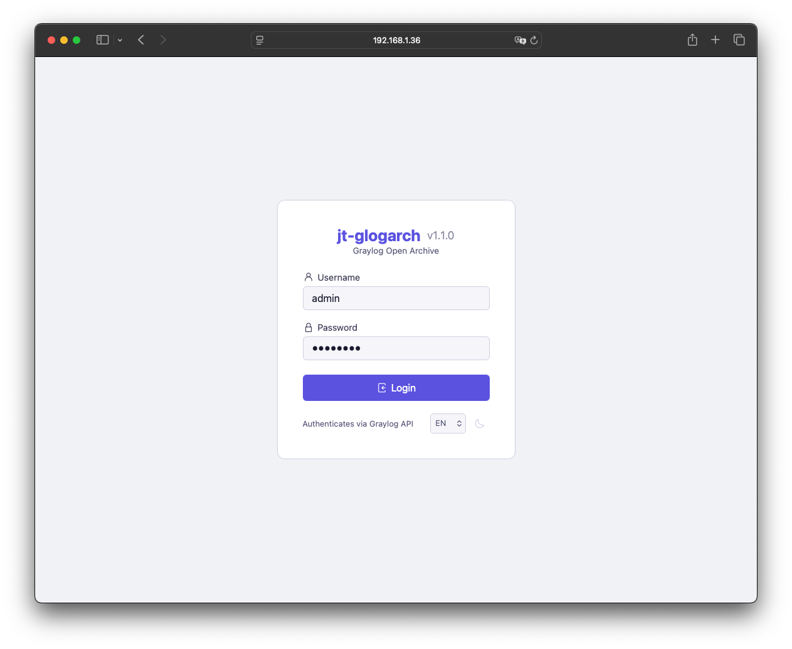
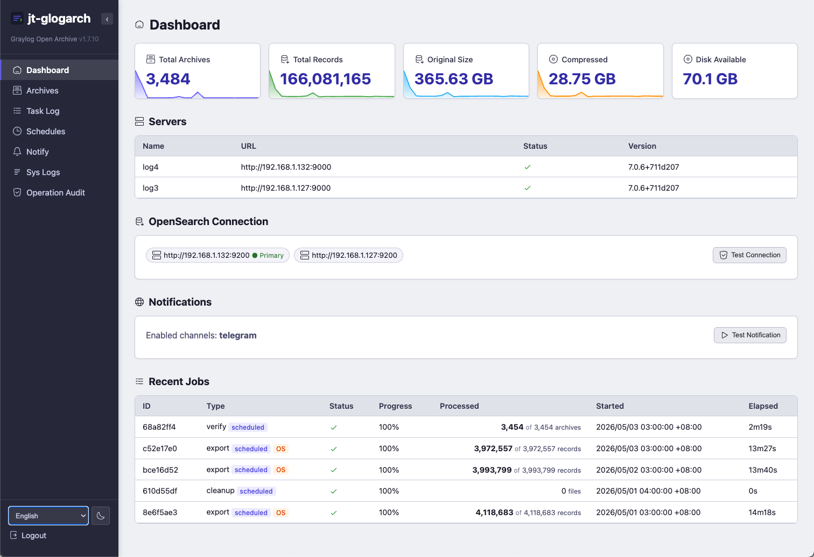
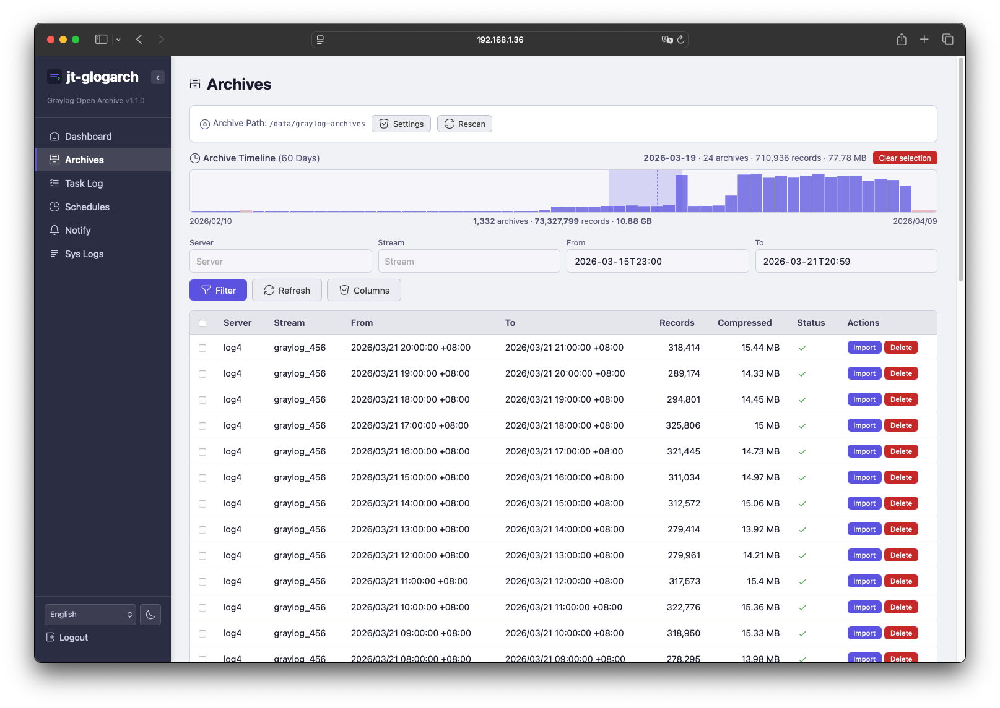
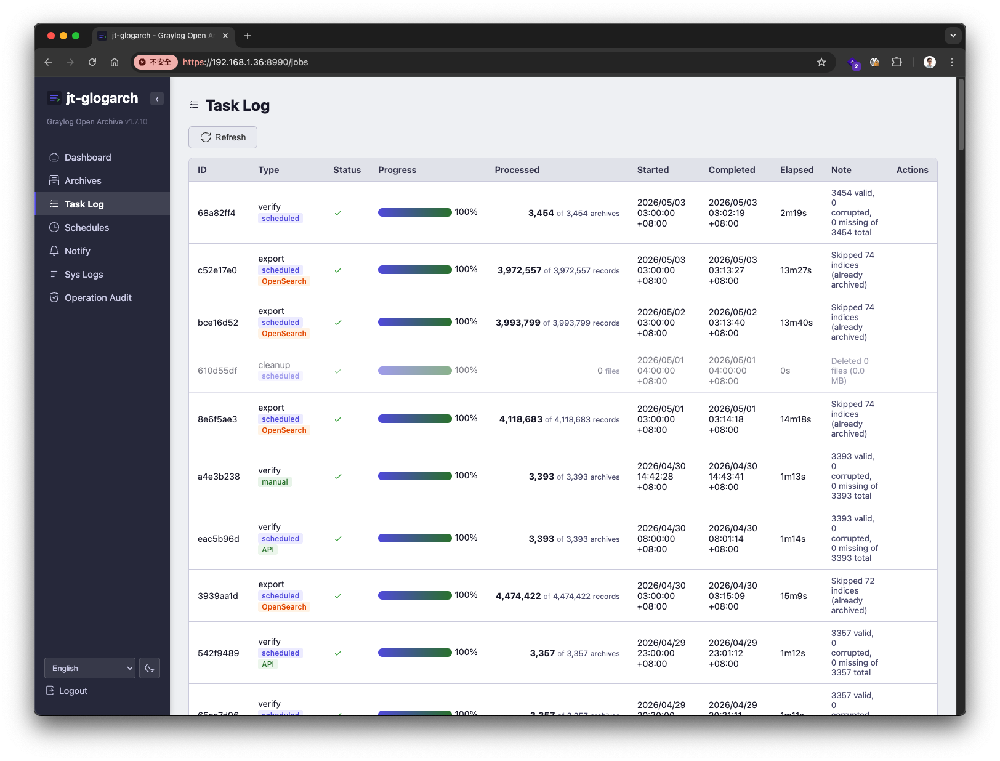
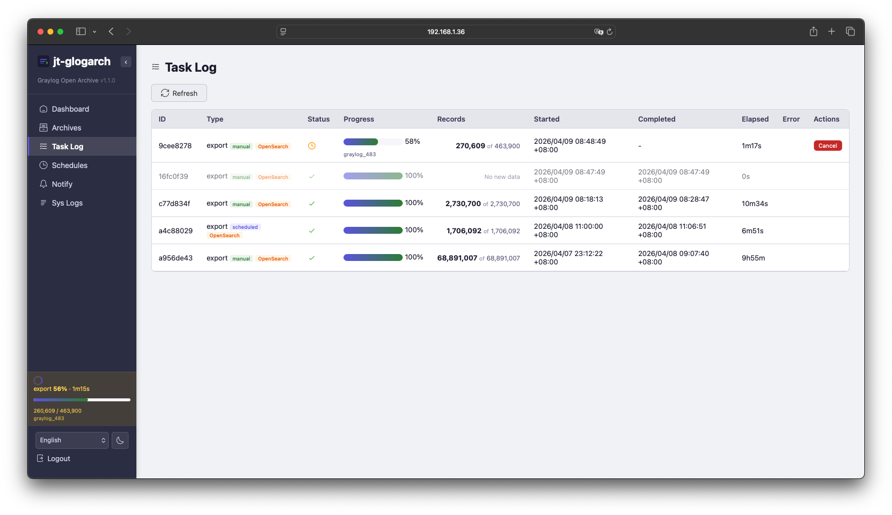
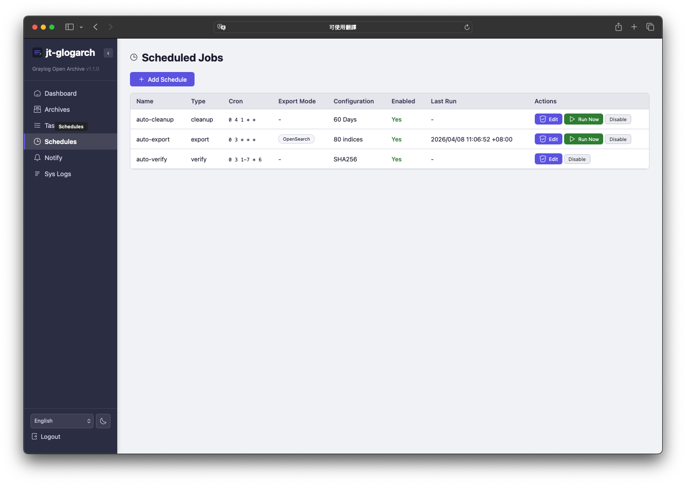
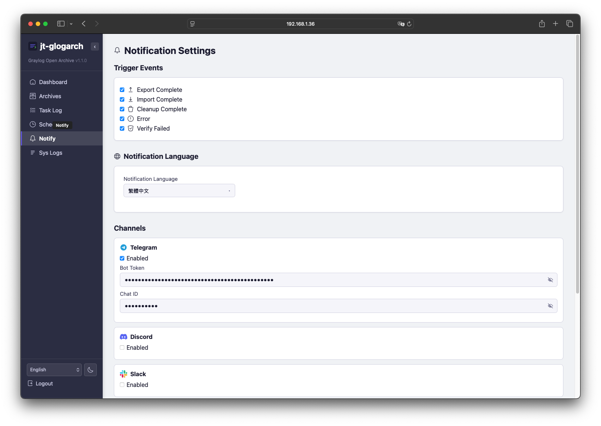
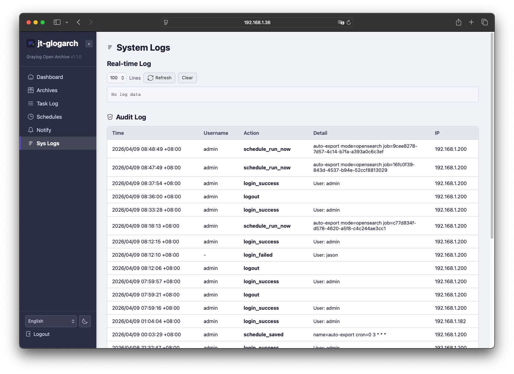
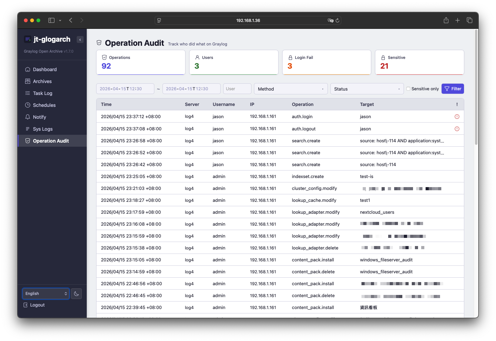
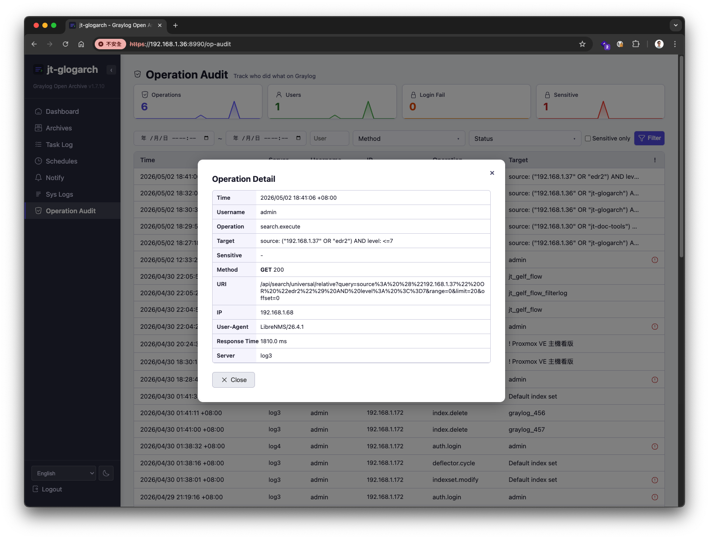

# jt-glogarch v1.7.14

**Language**: **English** | [繁體中文](README-zh_TW.md)  
**Website**: <https://jasoncheng7115.github.io/jt-glogarch/>

**Graylog Open Archive** — Archive & restore logs for Graylog Open (6.x / 7.x)

[](LICENSE)
[]()
[]()

Graylog Open does not include the Archive feature available in the Enterprise edition.
**jt-glogarch** fills this gap by providing a complete log archival and restoration
toolkit, supporting **two export modes**:

1. **Graylog REST API** — Standard, works with any Graylog Open install
2. **OpenSearch Direct** — Bypasses Graylog and queries OpenSearch directly (~5× faster)

It exports logs to compressed archives (`.json.gz`) with SHA256 integrity verification,
and can restore them back into any Graylog instance via GELF (UDP / TCP).

> **Author:** Jason Cheng ([Jason Tools](https://github.com/jasoncheng7115))
> **License:** Apache 2.0


---


## Table of Contents

- [Features](#features)
- [Architecture & How It Works](#architecture--how-it-works)
- [Use Cases](#use-cases)
- [Quick Start](#quick-start)
- [Installation Details](#installation-details)
- [Configuration](#configuration)
- [Web UI Guide](#web-ui-guide)
  - [Dashboard](#dashboard)
  - [Archive List](#archive-list)
  - [Job History](#job-history)
  - [Schedules](#schedules)
  - [Notification Settings](#notification-settings)
  - [System Logs](#system-logs)
  - [Operation Audit](#operation-audit)
- [Import (Restore) Workflow](#import-restore-workflow)
- [Performance & Tuning](#performance--tuning)
- [CLI Reference](#cli-reference)
- [Troubleshooting / FAQ](#troubleshooting--faq)
- [License & Author](#license--author)


---


## Features


### Dual Export Modes

| Feature | Graylog API | OpenSearch Direct |
|---|---|---|
| Speed | ~730 records/s | ~3,300 records/s |
| Pagination | Time-window (works around 10K offset limit) | `search_after` (no limit) |
| Stream filter | ✅ Yes | ❌ No (per index) |
| Requires | Graylog API token | OpenSearch credentials |
| Memory guard | JVM heap monitoring (auto-stop @ 85%) | N/A |
| Best for | Stream-specific exports, clusters where OpenSearch is locked down | Bulk historical exports, time-sensitive jobs |
| Graylog 7 Data Node | ✅ Supported | ❌ Not supported (see note below) |

> **Graylog 7 Data Node users:** Data Node environments use Graylog-managed TLS certificate authentication for OpenSearch. No credentials are exposed externally, so external tools cannot access OpenSearch directly. **OpenSearch Direct export** and **OpenSearch Bulk import** are not available in Data Node environments. Use **Graylog API export** and **GELF import** instead. Standalone OpenSearch deployments are unaffected.
>
> **Recommendation: Do not use Data Node.** When installing Graylog, configure it to connect directly to a standalone OpenSearch deployment instead of using Data Node. This enables OpenSearch Direct high-speed export (~5× faster) and OpenSearch Bulk high-speed import (~5-10× faster). Data Node simplifies initial setup but locks down external OpenSearch access, severely limiting archive and restore performance.


### Smart Deduplication

- **Same-mode** exact match prevents re-exporting identical time ranges
- **Cross-mode** coverage check prevents duplicates when switching between API and OpenSearch
- **Resume from interruption** — completed chunks are never re-exported


### Archive Management

- **Streaming write** — never holds all messages in memory
- Auto file splitting at configurable size (default 50MB)
- SHA256 integrity verification with `.sha256` sidecar files (`--workers N` for parallel)
- Scheduled SHA256 re-verification
- Retention-based auto-cleanup (with write-in-progress race guard)
- Rescan archives from disk (detect orphan / missing files)
- **DB backup** — `glogarch db-backup` online snapshot with auto-prune
- **DB rebuild** — `glogarch db-rebuild` reconstruct metadata DB from archive files (disaster recovery)


### Import (Restore)

Two import modes (selectable in the import dialog):

- **GELF (Graylog Pipeline)** — default. Sends each message via GELF TCP/UDP
  through the full Graylog input → process → indexer chain. Compatible with
  pipeline rules, extractors, stream routing, and alerts.
- **OpenSearch Bulk** — direct write to OpenSearch via `_bulk` API. 5-10×
  faster, skips Graylog processing entirely. For "restore as-is" use cases.

Both modes:
- Preserve original `timestamp`, `source`, `level`, `facility`, and all custom fields
- Run a complete pre-flight compliance check before any data is sent
- Reconcile after import: 0 indexer failures = compliance pass

GELF mode also has:
- **Flow control** — pause/resume, real-time speed adjustment
- **Journal monitoring** — auto-throttle based on target Graylog journal status (Graylog API)


### Web UI

- **Dashboard** — Grafana-style sparkline stat cards, server status, recent jobs
- **Archive List** — Filtering, sorting, batch operations, drag-to-select timeline
- **Job History** — Real-time progress (SSE), elapsed time, cancel, source/mode badges
- **Schedule Management** — Cron editor, inline progress, "Run Now"
- **Notification Settings** — 6 channels with language selection
- **System Logs** — Real-time log viewer + audit log
- **Operation Audit** — Track who did what on Graylog (60+ operation types, filterable, sensitive operation alerts)
- Dark/Light theme, English/Traditional Chinese
- Collapsible sidebar, HTTPS, session authentication


### Notifications

Telegram • Discord • Slack • Microsoft Teams • Nextcloud Talk • Email (SMTP)

Triggers: export complete, import complete, cleanup complete, errors, verification failed, sensitive operations, audit alerts.
Bilingual messages (English / Traditional Chinese).


### Scheduling (APScheduler)

- **Export** — Cron-based with API or OpenSearch mode
- **Cleanup** — Auto-remove expired archives
- **Verify** — Periodic SHA256 integrity check
- Predefined frequencies (hourly, daily, weekly, monthly first Saturday, custom cron)
- "Run Now" for all types


### Safety & Performance

- **Emergency local login** — when Graylog is offline, login with `localadmin` account (SHA256 hashed password, generate with `glogarch hash-password`)
- **Health check endpoint** — `GET /api/health` (no auth), returns DB/disk/scheduler status for Prometheus / Uptime Kuma
- **JVM memory guard** — auto-pauses API export when Graylog heap > 85%, resumes after GC recovery (stops after 5 min if unrecoverable)
- **OpenSearch transient error retry** — auto backoff on 500/502/503/429
- Concurrent export lock per server + concurrent import lock per archive
- Adaptive rate limiting with CPU-based backoff
- Secret sanitization — passwords/tokens auto-redacted from error messages
- Archive directory ownership auto-repair (root-created dirs auto-chowned)
- **`glogarch streams-cleanup`** — clean up bulk-import-created Streams / Index Sets
- Thread-safe SQLite (WAL mode)
- Disk space monitoring


---


## Architecture & How It Works

### Overview

```
+-----------------+     +------------------+     +------------------+
|  Graylog Open   |     |   jt-glogarch    |     |  Graylog Open    |
|  (Production)   |     |                  |     |  (Query / DR)    |
|                 |     |  +------------+  |     |                  |
|  Logs --------->|---->|  | .json.gz   |  |---->|  Restored Logs   |
|                 | API |  | Archives   |  | GELF|                  |
|  OpenSearch     | or  |  | + SHA256   |  |  or |  Searchable in   |
|  Indices        | OS  |  +------------+  | Bulk|  Graylog UI      |
+-----------------+     +------------------+     +------------------+
      Export (API          Storage + DB             Import (GELF TCP
      or OpenSearch)       + Web UI + CLI           or OS Bulk)
```

### Internal Architecture

```
+--------------------------------------------------------------------+
|                            jt-glogarch                             |
|                                                                    |
|   +-------------+         +------------------------------+         |
|   |   Web UI    | <-----> |  FastAPI + Jinja2 + JS SPA   |         |
|   |   (HTTPS)   |         +------------------------------+         |
|   +-------------+                                                  |
|                                                                    |
|   +-------------+    +-----------------+    +-------------+        |
|   |  REST API   |    |   APScheduler   |    |     CLI     |        |
|   +------+------+    +--------+--------+    +------+------+        |
|          |                    |                    |               |
|          +--------------------+--------------------+               |
|                               |                                    |
|                               v                                    |
|   +------------------------------------------------------------+   |
|   |          Export / Import / Cleanup / Verify                |   |
|   +-------+----------------+----------------+------------------+   |
|           |                |                |                      |
|           v                v                v                      |
|   +-------------+  +---------------+  +---------------+            |
|   |   SQLite    |  |   Streaming   |  |  GELF Sender  |            |
|   |     DB      |  |    Writer     |  |  (UDP / TCP)  |            |
|   +-------------+  +-------+-------+  +-------+-------+            |
|                            |                  |                    |
+----------------------------+------------------+--------------------+
                             v                  v
                    +----------------+  +----------------+
                    |    .json.gz    |  |    Graylog     |
                    | Archive Files  |  |   GELF Input   |
                    +----------------+  +----------------+
```


### Export Flow (Graylog API mode)

1. Build hourly time chunks for the requested range
2. For each chunk:
   - Skip if already archived (same-mode dedup)
   - Skip if covered by OpenSearch archive (cross-mode dedup)
   - Query Graylog Universal Search with stream filter and time range
   - Stream messages directly to gzip file (no full buffering)
   - Compute SHA256, write `.sha256` sidecar
   - Record in SQLite DB
3. Periodically check Graylog JVM heap; auto-pause if >85%, resume after GC
4. Send notification with results


### Export Flow (OpenSearch Direct mode)

1. List all OpenSearch indices for the configured prefix
2. Skip the active write index
3. Filter to "keep N most recent" indices (or by time range)
4. For each index, **single-scan** the entire index sorted by timestamp
5. Split documents into hourly archive files as scan progresses
6. Each completed hourly file is recorded immediately (resume-friendly)
7. Send notification with results


---


## Use Cases


### 1. Compliance — Long-term Log Retention

Your security team requires 1 year of authentication logs, but Graylog Open's index
retention is set to 90 days for performance. Schedule a daily export of the
authentication stream and let `jt-glogarch` archive everything beyond 90 days to
cheap storage.

> Setup: Schedule → Daily 03:00 → API mode → Stream filter `authentication-stream`


### 2. Forensics — Restore Old Logs for Investigation

A security incident from 6 months ago needs investigation, but those logs were
rotated out of Graylog. Find the relevant archive on the Archive List page,
click "Import", point at your active Graylog instance with GELF UDP, and re-inject.

> Workflow: Archive List → Filter time range → Select archives → Batch Import → GELF UDP


### 3. Migration — Move from Old to New Graylog Cluster

Export everything from the old cluster via OpenSearch Direct (fast bulk export),
then import to the new cluster via GELF.

> Workflow: OpenSearch Direct mode → Export by index → Transfer files → Import to new GELF


### 4. Disaster Recovery — Off-site Archive

Schedule daily exports to a mounted NFS / S3 / cloud storage location. Even if
your Graylog cluster dies, you have searchable archives.

> Setup: Mount remote storage to `/data/graylog-archives` → Schedule daily export


### 5. Cost Reduction — Reduce Hot Storage

Your OpenSearch hot tier is expensive. Archive older indices to compressed
storage (~10× compression ratio) and rely on the active OpenSearch only for
recent searches.

> Setup: OpenSearch mode → Export "keep recent 30 indices" → Cleanup with retention 90 days


### 6. Operation Audit — Independent Tracking of Graylog Admin Actions

Compliance frameworks (ISO 27001, PCI-DSS, GDPR, etc.) require an audit trail
of administrator actions, but Graylog's built-in audit log is managed by
Graylog itself — **any user with admin rights can delete or tamper with it**,
which makes it untrustworthy from an auditor's perspective. `jt-glogarch`
side-channels every API call that passes through nginx into a SQLite database
that **Graylog admins cannot access**. It captures 60+ operation types
(create / modify / delete of streams, pipelines, users, searches, content
packs, lookup tables, etc.), supports real-time notifications for sensitive
operations (multi-channel), and a heartbeat detector that alerts immediately
if nginx forwarding is disabled.

> Setup: Operation Audit page → Get nginx config template → Apply on each Graylog node → Enable notifications


---


## Quick Start


### Requirements

- Python 3.10+
- Graylog 6.x or 7.x (Open edition)
- OpenSearch 2.x (optional, for direct mode)
- Linux (Ubuntu 22.04 / Debian 12 / RHEL 9 tested)


### Install (5 minutes)

```bash
# 1. Clone the repository
sudo git clone https://github.com/jasoncheng7115/jt-glogarch.git /opt/jt-glogarch
cd /opt/jt-glogarch

# 2. Run the install script (creates user, dirs, SSL cert, systemd service)
sudo bash deploy/install.sh

# 3. Edit the config with your Graylog details
sudo vi /opt/jt-glogarch/config.yaml

# 4. Start the service
sudo systemctl enable --now jt-glogarch

# 5. Open the Web UI
echo "Open: https://$(hostname):8990"
```

Login with your Graylog credentials.

### Upgrade

```bash
sudo bash /opt/jt-glogarch/deploy/upgrade.sh
```

Pulls the latest tag from this repo, takes an online SQLite snapshot of
`jt-glogarch.db` into `/var/backups/jt-glogarch/` first, applies any new
config defaults to `config.yaml`, force-reinstalls the Python package, and
restarts the service. Safe to run while jt-glogarch is active — there is
no data loss step.

### Uninstall

```bash
sudo bash /opt/jt-glogarch/deploy/uninstall.sh
```

Stops the service, removes the systemd unit, and `pip uninstall`s the
package. Then asks **separately** before deleting any of:

- `/data/graylog-archives` (the actual archive `.json.gz` files)
- `/etc/jt-glogarch` (config dir, if you used it)
- `/opt/jt-glogarch` (source + DB + certs — losing this means losing the
  job/audit history and SSL keypair)
- the `jt-glogarch` system user

Defaults to **keep** for every destructive prompt. If you also wired
nginx to forward audit syslog into port 8991, remove the corresponding
`access_log syslog:server=...` line from your Graylog nodes' nginx
config and reload nginx.

### Setup Operation Audit (nginx)

jt-glogarch includes a built-in Operation Audit feature that tracks who did what on Graylog. It works by receiving access logs from nginx reverse proxies on your Graylog servers. **Enabled by default** — just configure nginx.

> Skip this section if you don't need operation auditing.

**On each Graylog server**, install and configure nginx as a reverse proxy:

```bash
# 1. Install nginx (skip if already installed)
sudo apt install -y nginx

# 2. Create SSL certificate (skip if you already have one)
sudo openssl req -x509 -newkey rsa:2048 -nodes \
    -keyout /etc/ssl/private/graylog.key \
    -out /etc/ssl/certs/graylog.crt \
    -days 3650 -subj "/CN=$(hostname)"

# 3. Add audit log format to /etc/nginx/nginx.conf
#    Add INSIDE the http { } block, BEFORE any "include" lines:
```

```nginx
    log_format graylog_audit escape=json
            '{'
            '"time":"$time_iso8601",'
            '"remote_addr":"$remote_addr",'
            '"method":"$request_method",'
            '"uri":"$uri",'
            '"args":"$args",'
            '"status":$status,'
            '"body_bytes_sent":$body_bytes_sent,'
            '"request_body":"$request_body",'
            '"http_authorization":"$http_authorization",'
            '"http_cookie":"$cookie_authentication",'
            '"user_agent":"$http_user_agent",'
            '"request_time":$request_time,'
            '"server_name":"$server_name"'
            '}';
```

```bash
# 4. Create Graylog site config: /etc/nginx/sites-available/graylog
```

```nginx
server {
        listen 443 ssl;
        server_name graylog.example.com;

        ssl_certificate /etc/ssl/certs/graylog.crt;
        ssl_certificate_key /etc/ssl/private/graylog.key;

        location / {
                proxy_pass http://127.0.0.1:9000/;
                proxy_http_version 1.1;
                proxy_set_header Host $host;
                proxy_set_header X-Real-IP $remote_addr;
                proxy_set_header X-Forwarded-For $proxy_add_x_forwarded_for;
                proxy_set_header X-Graylog-Server-URL https://$host/;
                proxy_pass_request_headers on;
                proxy_buffering off;
                client_max_body_size 8m;
        }

        # Operation Audit — send access logs to jt-glogarch
        access_log syslog:server=JT_GLOGARCH_IP:8991,facility=local7,tag=graylog_audit graylog_audit;
        client_body_buffer_size 64k;
}

# Optional: redirect HTTP to HTTPS
server {
        listen 80;
        return 301 https://$host$request_uri;
}
```

```bash
# 5. Replace JT_GLOGARCH_IP with your jt-glogarch server IP in the config above

# 6. Enable the site and test
sudo ln -sf /etc/nginx/sites-available/graylog /etc/nginx/sites-enabled/
sudo nginx -t && sudo systemctl reload nginx

# 7. Open UDP port 8991 on the jt-glogarch server firewall
#    (run this on the jt-glogarch server, not the Graylog server)
sudo ufw allow 8991/udp

# 8. IMPORTANT: Block direct access to Graylog port 9000
#    Only allow localhost (nginx) and other Graylog cluster nodes.
#    This forces all users through nginx, ensuring complete audit coverage.
#    Replace CLUSTER_NODE_IP with each Graylog node IP in your cluster.
sudo ufw deny 9000
sudo ufw allow from 127.0.0.1 to any port 9000
sudo ufw allow from CLUSTER_NODE_IP to any port 9000
# Repeat the above line for each Graylog cluster node
```

After setup, open the jt-glogarch Web UI → **Operation Audit** page to verify data is flowing in.

> **Important:**
> - The `log_format` block must be placed **before** `include` lines in `nginx.conf`
> - Replace `JT_GLOGARCH_IP` with the actual IP of your jt-glogarch server
> - Replace `CLUSTER_NODE_IP` with each Graylog cluster node IP
> - **Port 9000 must be blocked** from external access — if users can bypass nginx, their operations will not be audited
> - For Graylog clusters, repeat steps 3-8 on **every** Graylog node
> - After blocking port 9000, access Graylog via `https://<hostname>` (port 443) instead
> - See [AUDIT-OPERATIONS.md](AUDIT-OPERATIONS.md) for the full list of tracked operations


---


## Installation Details


### Manual Installation

If you prefer not to use `install.sh`:

```bash
# 1. Install Python dependencies
pip install --no-build-isolation --no-cache-dir /opt/jt-glogarch

# 2. Create system user
useradd -r -s /bin/false -d /opt/jt-glogarch jt-glogarch

# 3. Create archive storage
mkdir -p /data/graylog-archives
chown -R jt-glogarch:jt-glogarch /data/graylog-archives

# 4. Generate self-signed SSL certificate
mkdir -p /opt/jt-glogarch/certs
openssl req -x509 -newkey rsa:4096 -nodes \
  -keyout /opt/jt-glogarch/certs/server.key \
  -out /opt/jt-glogarch/certs/server.crt \
  -days 3650 -subj '/CN=jt-glogarch'

# 5. Copy config template
cp /opt/jt-glogarch/deploy/config.yaml.example /opt/jt-glogarch/config.yaml
chown jt-glogarch:jt-glogarch /opt/jt-glogarch/config.yaml

# 6. Install systemd unit
cp /opt/jt-glogarch/deploy/jt-glogarch.service /etc/systemd/system/
systemctl daemon-reload
systemctl enable --now jt-glogarch
```


### Verifying the Installation

```bash
# Service status
systemctl status jt-glogarch

# Live logs
journalctl -u jt-glogarch -f

# Test Web UI (should return HTTP 200)
curl -sk https://localhost:8990/login -o /dev/null -w '%{http_code}\n'

# Health check (should return version + healthy)
curl -sk https://localhost:8990/api/health
```


### Upgrading

When a new version is available on GitHub, upgrade with one command:

```bash
sudo bash /opt/jt-glogarch/deploy/upgrade.sh
```

The upgrade script automatically: backs up DB → git pull → pip install → restart service → verify version.

> - `config.yaml` and `jt-glogarch.db` are not tracked by git — they won't be overwritten
> - New config fields added in newer versions use sensible defaults automatically
> - DB schema is auto-migrated on service startup (`_migrate()`)
> - Check the [CHANGELOG](CHANGELOG.md) after upgrading for any breaking changes


---


## Configuration

The config file lives at `/opt/jt-glogarch/config.yaml` and **must be owned by `jt-glogarch`**.

After installation, just fill in the Graylog connection info. Everything else can be configured from the Web UI.

```yaml
# === Required: Graylog connection ===
servers:
  - name: log4
    url: "http://YOUR_GRAYLOG_IP:9000"
    auth_token: "YOUR_GRAYLOG_API_TOKEN"

default_server: log4

# === Required: archive storage path ===
export:
  base_path: /data/graylog-archives

# === Optional: OpenSearch direct mode (skip if not using) ===
opensearch:
  hosts:
    - "http://YOUR_OS_IP:9200"
  username: admin
  password: "YOUR_OS_PASSWORD"

# === Optional: DB path (default is fine) ===
database_path: /opt/jt-glogarch/jt-glogarch.db
```

> Schedules, notifications, import settings, and retention policies can all be configured in the Web UI under "Schedules" and "Notification Settings".
> For the full config reference, see [CONFIG.md](CONFIG.md) or [`deploy/config.yaml.example`](deploy/config.yaml.example).


---


## Web UI Guide

The Web UI is the **primary interface**. CLI is available for automation and scripting.

Login uses your Graylog credentials — there is no separate user database. Authentication is delegated to the Graylog REST API.




### Dashboard



The home page shows five key statistics with sparkline charts:

| Card | What it shows |
|---|---|
| **Total Archives** | Number of completed archive files |
| **Total Records** | Total log records archived |
| **Original Size** | Pre-compression total size |
| **Compressed** | On-disk total size (after gzip) |
| **Disk Available** | Free space on the archive volume |

The sparkline behind each card shows the last 30 days of daily activity.
Hover over any bar to see exact values for that day.

Below the cards:
- **Servers** — Connected Graylog servers and their status
- **OpenSearch** — Connection test status (right-click a host to make it primary)
- **Notifications** — Active notification channels with a "Send test" button
- **Recent Jobs** — Last 5 jobs with progress, source/mode badges, elapsed time


### Archive List



This is where you manage all your archives.

**Top section:**
- **Archive Path** — Current storage location with "Settings" (change path) and "Rescan" (sync from disk)
- **Archive Timeline** — A daily distribution chart showing the entire history of your archives
  - Bar height = number of records that day
  - **Drag** to select a time range (hour-level precision) — auto-fills the filter and applies it
  - **Hover** any column to see day, archives, records, size
  - Red marks = days with no archives (gaps)
  - Click **Clear selection** to reset

**Filters:** Server, Stream, Time From, Time To. Click "Filter" to apply.

**Table:**
- Sortable columns (server-side sort, persists across pages)
- **Batch select** — Use checkboxes, Shift+select-all for cross-page batch
- **Per-row actions:** Import (single), Delete

**Batch actions** (when rows are selected):
- **Batch Import** — Opens import modal with GELF settings + flow control
- **Batch Delete** — Removes files from disk and marks records as deleted

**Column settings** — Toggle columns on/off (saved in localStorage)


### Job History




Shows all export, import, cleanup, and verify jobs.

| Column | Description |
|---|---|
| ID | First 8 chars of job UUID |
| Type | export / import / cleanup / verify with badges (manual/scheduled, API/OpenSearch) |
| Status | running / completed / failed / cancelled |
| Progress | Inline bar + percentage; running jobs show current chunk/index |
| Records | done / total with bold/dimmed format |
| Started | Job start time |
| Completed | Job end time |
| Elapsed | Duration |
| Error | Error message if failed |
| Actions | Cancel button for running jobs |

Jobs that completed with **0 new records** are dimmed and show "no new data" — this
is normal for scheduled exports when nothing new accumulated.


### Schedules



Manage automated jobs. Three types are supported:

#### Export Schedule

```
Name:       auto-export
Type:       Export
Frequency:  Daily 03:00
Mode:       OpenSearch Direct
Retention:  Last 60 indices    ← Or "N days" for API mode
```

For OpenSearch mode, you choose **how many recent indices** to export. The
"available indices" timeline at the bottom shows which indices exist (and which
is the active write index, which is always excluded).

#### Cleanup Schedule

```
Name:       auto-cleanup
Type:       Cleanup
Frequency:  Monthly day 1 04:00
Retention:  1095 days
```

Removes archive files older than the retention period and updates the DB.

#### Verify Schedule

```
Name:       auto-verify
Type:       Verify
Frequency:  Monthly first Saturday 03:00
```

Re-verifies SHA256 checksum of all archives. Failed checksums are marked as
**corrupted** in the DB and shown in the Archive List with a red warning icon.

**Run Now button** — All schedule types support manual immediate execution.
For export jobs, the inline progress is shown directly on the schedule row.


### Notification Settings



Configure where notifications are sent.

**Notification Language** — Choose between English and 繁體中文. This applies to
**all** notification messages (test notification, export complete, errors, etc.).

**Trigger Events** — Check which events should send notifications:
- Export complete
- Import complete
- Cleanup complete
- Error
- Verify failed
- Sensitive operation (Operation Audit — user deletion, auth changes, etc.)
- Audit alert (Operation Audit — no syslog received for 10+ minutes)

**Channels** — Configure each channel. **Unchecking "Enabled"** automatically
collapses the channel's settings to keep the page tidy.

> **Credential masking:** All sensitive fields (Bot Token, Chat ID, webhook URLs,
> Nextcloud token / username / password, SMTP host / user / password, etc.) are
> rendered as masked password inputs. Click the eye-icon button on the right of
> each field to temporarily reveal the value. Browser autocomplete is disabled
> on these fields to prevent accidental autofill.

| Channel | Required Fields |
|---|---|
| Telegram | Bot token, Chat ID |
| Discord | Webhook URL |
| Slack | Webhook URL |
| Microsoft Teams | Webhook URL |
| Nextcloud Talk | Server URL, Token, Username, Password |
| Email (SMTP) | Host, Port, TLS, User, Password, From, To |

Click **Send test notification** to verify all enabled channels work. Test messages
are sent in the configured language.


### System Logs



Real-time tail of `journalctl -u jt-glogarch` plus an audit log of user actions
(login, export started, settings saved, etc.).


### Operation Audit



Track who did what on Graylog — compliance-grade auditing independent from Graylog itself.

**Key advantages:**
- Records full request body — you can see exactly what was changed, what query was searched, what account was created
- Audit records stored independently from Graylog — administrators cannot delete their own audit trail

**How it works:**
- nginx on each Graylog node sends JSON access logs via UDP syslog to jt-glogarch (port 8991)
- jt-glogarch receives, parses, classifies into 60+ operation types, resolves usernames, and stores in SQLite
- IP allowlist auto-built from Graylog Cluster API — zero configuration needed
- Only meaningful operations are recorded; background polling, static assets, metrics are automatically filtered

**Page layout:**

1. **Status bar** — Listener status (running/disabled), UDP port, last received timestamp, record count, retention days, heartbeat alert
2. **Stat cards** (last 24h) — Total operations, unique users, login failures, sensitive operations, with sparkline trends
3. **Filter bar** — Time range, username, HTTP method, URI pattern, status code, sensitive only toggle
4. **Results table** — Time, server, username, method (color-coded badge), URI, status (color-coded), operation type, target name (human-readable resource name), sensitive marker
5. **Detail modal** — Click any row to see full detail including formatted JSON request body with syntax highlighting and copy button
6. **Settings section** — nginx configuration snippet with copy button, listener toggle



**Username resolution chain:**

| Method | Description |
|--------|-------------|
| Basic Auth | Username extracted from `Authorization` header |
| Token Auth | Resolved via per-user Graylog token API, cached by prefix |
| Session Auth | Session ID from `Authorization` header, resolved via Graylog Sessions API |
| Cookie Session | Session ID from `$cookie_authentication` cookie in nginx log |
| IP Cache | Falls back to client IP → last known user mapping |
| Single User | When only one human account exists, auto-attributed |

**Target name resolution:**

Resource IDs in URIs are automatically resolved to human-readable names via the Graylog API cache (refreshed every 6 minutes):
inputs, streams, index sets, dashboards/views, pipelines, pipeline rules, event definitions, event notifications, lookup tables/adapters/caches, content packs, authentication services, outputs, users, roles.

**Sensitive operation alerts:**

When `op_audit.alert_sensitive` is enabled, sensitive operations (user deletion, stream deletion, authentication changes, system shutdown, etc.) trigger notifications via all configured channels.

**Heartbeat monitoring:**

If the listener is running and Graylog is reachable but no syslog has been received for 10+ minutes, an alert is triggered — indicating a silent failure in the audit pipeline (e.g., nginx misconfiguration, network issue).

**Config:**
```yaml
op_audit:
  enabled: true          # enabled by default
  listen_port: 8991      # UDP syslog port
  retention_days: 180    # independent from archive retention (default 180 days)
  max_body_size: 65536   # max request body size to store (64KB)
  alert_sensitive: true  # send alerts on sensitive operations
```

**Retention:** Audit records are automatically cleaned up by the scheduled cleanup job. The `op_audit.retention_days` setting (default 180 days) is independent from the archive retention policy (default 1095 days). Estimated storage: ~2 KB per record, ~360 MB per year at 1000 operations/day.

> For the complete list of 60+ tracked operation types, see [AUDIT-OPERATIONS.md](AUDIT-OPERATIONS.md).
>
> For nginx setup instructions, see [Quick Start — Setup Operation Audit](#setup-operation-audit-nginx).


---


## Import (Restore) Workflow

The import flow is built around a **compliance pipeline** designed to guarantee
**zero message loss + zero indexer failures**. Key safeguards (all run automatically
before any GELF send):

1. **Cluster health check** — refuses to import into a RED OpenSearch cluster
2. **GELF input verification** — must exist on the configured port and be RUNNING
3. **Capacity check** — calculates how many indices the import will create from
   the rotation strategy and aborts if the target's deletion-based retention
   policy would erase data we just wrote
4. **Field mapping conflict resolution** — reads each archive's recorded `field_schema` from the DB, finds fields where archives have intra-conflict types or where the target's current mapping is numeric while archives have string values, and **automatically pins those fields as `keyword` on the target** via Graylog's custom field mappings API
5. **OpenSearch field-limit override** — automatically PUTs an OpenSearch index
   template that raises `index.mapping.total_fields.limit` to 10000, eliminating
   the rotation failure that hits Graylog's default 1000-field limit when many
   custom mappings are set
6. **Index rotation** — issues a single deflector cycle so the new mappings
   take effect on the new active write index
7. **GELF send** with TCP backpressure + Graylog journal monitoring (auto-pause
   when uncommitted entries exceed 500K)
8. **Post-import reconciliation** — queries Graylog's indexer-failures count
   and compares against the pre-import baseline; any non-zero delta is recorded
   as a compliance violation in the job's `error_message`

### Required: Target Graylog API credentials

Since v1.3.0, the import dialog **requires** a Graylog API URL + token (or
username/password). The same credentials power preflight, journal monitoring,
and reconciliation. There is no longer a "no monitoring" option.

### Two import modes (since v1.3.0)

The import dialog has a **mode selector** at the top:

| Mode | Speed | Goes through | Use when |
|---|---|---|---|
| **GELF (Graylog Pipeline)** (default) | ~5,000 msg/s | Graylog Input → Process buffer → Output buffer → OpenSearch | You need Graylog rules (pipelines, extractors, stream routing, alerts) to run on the imported data |
| **OpenSearch Bulk** | ~30,000-100,000 msg/s | Direct OpenSearch `_bulk` API | You're restoring already-processed historical data and want maximum speed |

**Bulk mode trade-offs:**
- ✅ **5-10x faster** (no GELF framing, no Graylog journal write, no buffer pressure)
- ✅ **Per-document precise reconciliation** from `_bulk` response (no reliance on Graylog's circular failure buffer)
- ✅ **No alert side-effects** (messages don't go through stream routing)
- ❌ **Skips ALL Graylog processing rules** — pipelines, extractors, stream routing, alerts. The data lands in OpenSearch as-is from the archive.
- ❌ **Needs OpenSearch credentials** in addition to the Graylog API ones (auto-detected by default).

**Where bulk-imported data goes:**
- Bulk mode writes to a **dedicated index pattern** (default `jt_restored_*`),
  not the live `graylog_*` indices. This keeps restored data fully isolated from
  live traffic.
- Each daily index is named `<pattern>_YYYY_MM_DD` based on the message
  timestamp. So importing 4/7 + 4/8 produces `jt_restored_2026_04_07` and
  `jt_restored_2026_04_08`.
- During preflight, jt-glogarch automatically:
  1. Writes an OpenSearch index template for `<pattern>_*` with
     `total_fields.limit: 10000` and all string-typed fields pinned as
     `keyword` (avoids type-conflict rejections)
  2. Pre-creates each daily index (Graylog clusters typically have
     `action.auto_create_index = false`)
  3. **Auto-creates a Graylog Index Set** for the prefix so the restored
     data is searchable from the Graylog UI immediately. No manual
     "System / Indices" configuration needed.

**Deduplication:**
- Archives preserve `gl2_message_id`, which bulk mode uses as the OpenSearch
  document `_id`. Re-importing the same archive overwrites existing documents
  instead of creating duplicates.
- Two other strategies are available: `none` (allow duplicates) and `fail`
  (abort if a duplicate is detected).


### Step 1 — Select Archives

Go to **Archive List**, optionally filter by time range or stream, then select
archives via checkboxes. Click **Batch Import**.


### Step 2 — Configure GELF Target

```
GELF Host:    192.168.1.132
Port:         32202   ← Default for TCP. Switches to 32201 if you select UDP.
Protocol:     TCP   ← Default. Reliable, has backpressure
              UDP   ← Faster but can drop messages on buffer overflow
Target Name:  log-recovery
```

> The Port field auto-switches when you change the Protocol selector
> (TCP → 32202, UDP → 32201). If you've manually edited the port, your value is
> kept. Make sure your target Graylog has matching GELF Inputs configured on
> these ports.

> **⚠️ UDP vs TCP — important warning:**
> - **TCP (recommended, default):** Has built-in backpressure. When the target Graylog
>   input buffer fills, the TCP send blocks naturally and jt-glogarch slows down.
>   No message loss. Throughput ~1,000-3,000 msg/s.
> - **UDP (not recommended for bulk import):** Faster (~5,000-10,000 msg/s) but
>   **silently drops packets** when Graylog can't keep up. There is no error
>   reported back to jt-glogarch — `messages_done` will say "X sent" but the
>   target Graylog may have only received a fraction of that. Symptoms: visible
>   gaps in the imported timeline. **Loss rates of 20-30% are common** when
>   importing millions of messages over UDP without flow control.
>
> If you must use UDP, journal monitoring (Graylog API) is always-on and will
> auto-throttle when the target's uncommitted journal entries exceed 500K.
> Even then, UDP cannot fully prevent drops during the initial burst.


### Step 3 — Set Initial Speed

Use the **Batch Delay (ms)** slider to set how long to wait between batches.
- 5-50ms = aggressive (use only with monitoring)
- 100ms = balanced default
- 500-1000ms = conservative


### Step 4 — Provide Target Graylog API Credentials (REQUIRED)

This is **mandatory** since v1.3.0. The same credentials are used for preflight,
journal monitoring, and post-import reconciliation.

```
Graylog API URL:  http://192.168.1.132:9000
API Token:        YOUR_TOKEN          ← either Token...
   — OR —
Username:         admin               ← ...or Username + Password
Password:         ******
```

> The dialog will not let you start an import without these. Backend also
> rejects with HTTP 400 if missing.


### Step 5 — Start & Monitor

After clicking **Start Import**, the modal switches to a control panel:

- **Pause / Resume** — Halt the import without losing progress
- **Speed slider** — Adjust delay in real-time without restarting
- **Journal badge** — Shows current Graylog journal status:
  - 🟢 normal — full speed
  - 🟡 slow — uncommitted entries 100K-500K, delay tripled
  - 🟠 paused — uncommitted entries 500K-1M, auto-pause 30s
  - 🔴 stop — uncommitted entries >1M, import aborted + admin notification


### Auto-throttling Rules

| Journal `uncommitted_entries` | Action |
|---|---|
| < 100,000 | Normal speed (your set delay) |
| 100,000 — 500,000 | Slow mode (3× delay) |
| 500,000 — 1,000,000 | Pause 30 seconds |
| > 1,000,000 | Stop import + send notification |


---


## Performance & Tuning


### Benchmarks (with default config)

| Mode | batch_size | delay | Speed | 1 Hour (~175K records) |
|---|---|---|---|---|
| Graylog API | 1,000 | 5ms | ~730 rec/s | ~4 minutes |
| OpenSearch Direct | 10,000 | 2ms | ~3,300 rec/s | ~1 minute |


### When to use which mode

**Use Graylog API mode when:**
- You need stream-level filtering
- Your OpenSearch is locked down (no direct access)
- You want JVM memory protection (auto-stop at 85% heap)

**Use OpenSearch Direct mode when:**
- You need to export large historical volumes quickly
- You have OpenSearch credentials
- You want index-level granularity


### Tuning Tips

**For Graylog API mode** — If your Graylog cluster has plenty of headroom:
```yaml
export:
  batch_size: 2000              # Default 1000
  delay_between_requests_ms: 0  # Default 5ms
  jvm_memory_threshold_pct: 90.0
```
> ⚠️ Watch the JVM memory guard — if your Graylog OOMs, lower these.

**For OpenSearch Direct mode** — Already aggressive by default. You can push
batch_size to 20000+ on a beefy OpenSearch cluster.


---


## CLI Reference

The CLI is provided for automation and scripting. The Web UI is the primary
interface for day-to-day operations.

```bash
glogarch --help
```

| Command | Description |
|---|---|
| `glogarch server` | Start the Web UI + scheduler (this is what systemd runs) |
| `glogarch export` | Manual export (`--mode api|opensearch --days 180`) |
| `glogarch import` | Import archives (`--archive-id N --target-host HOST`) |
| `glogarch list` | List archives with filters |
| `glogarch verify` | Verify SHA256 of all archives |
| `glogarch cleanup` | Remove expired archives |
| `glogarch status` | Show system status |
| `glogarch schedule` | Manage scheduled jobs |
| `glogarch config` | Print a config template |


### Example: One-shot CLI export

```bash
sudo -u jt-glogarch glogarch export \
  --mode opensearch \
  --days 30
```


### Example: Restore archives from CLI

**GELF mode (default, goes through Graylog pipeline):**
```bash
sudo -u jt-glogarch glogarch -c /opt/jt-glogarch/config.yaml import \
  --archive-id 42 \
  --target-api-url http://192.168.1.83:9000 \
  --target-api-username admin \
  --target-api-password 'YOUR_PASSWORD' \
  --target test-restore
```

**OpenSearch Bulk mode (5-10x faster, skips Graylog processing):**
```bash
sudo -u jt-glogarch glogarch -c /opt/jt-glogarch/config.yaml import \
  --archive-id 42 \
  --mode bulk \
  --target-api-url http://192.168.1.83:9000 \
  --target-api-username admin \
  --target-api-password 'YOUR_PASSWORD' \
  --target-index-pattern jt_restored \
  --dedup-strategy id \
  --target test-restore
```

In bulk mode, the OpenSearch URL is auto-detected (`port 9000 → 9200`).
Pass `--target-os-url`, `--target-os-username`, `--target-os-password`
to override.

**Time-range bulk import:**
```bash
sudo -u jt-glogarch glogarch -c /opt/jt-glogarch/config.yaml import \
  --from 2026-04-07 --to 2026-04-09 \
  --mode bulk \
  --target-api-url http://192.168.1.83:9000 \
  --target-api-username admin \
  --target-api-password 'YOUR_PASSWORD' \
  --target full-restore
```


---


## Troubleshooting / FAQ


### "Permission denied" when writing to `/data/graylog-archives/`

The service runs as the `jt-glogarch` user. Make sure the archive directory is owned by it:
```bash
sudo chown -R jt-glogarch:jt-glogarch /data/graylog-archives
```


### Web UI shows "Not authenticated" but I just logged in

Self-signed certificate issue. Browser may have rejected the cookie. Try:
1. Click "Advanced" → "Proceed to site" on the SSL warning
2. Open in incognito window
3. Or use a real certificate via Let's Encrypt


### Pip install shows `Successfully installed UNKNOWN-0.0.0`

Old `setuptools` cannot read `pyproject.toml` metadata. Fix:
```bash
pip install --upgrade setuptools wheel
rm -rf /opt/jt-glogarch/build /opt/jt-glogarch/*.egg-info
pip install --no-build-isolation --no-cache-dir --force-reinstall /opt/jt-glogarch
```


### Scheduled job didn't run at the expected time

`jt-glogarch` uses APScheduler, which **inherits the system timezone**. If your
system is set to UTC and you wrote `cron: "0 3 * * *"` thinking "3 AM local time",
it will actually fire at 03:00 UTC (e.g. 11:00 in Asia/Taipei).

**Check the system timezone:**
```bash
timedatectl
```

**Set it to your local timezone:**
```bash
sudo timedatectl set-timezone Asia/Taipei
sudo systemctl restart jt-glogarch
```

After restart, the scheduler picks up the new timezone. You can verify the next
fire time with:
```bash
python3 -c '
from apscheduler.triggers.cron import CronTrigger
from apscheduler.schedulers.asyncio import AsyncIOScheduler
from datetime import datetime
s = AsyncIOScheduler()
print("scheduler tz:", s.timezone)
t = CronTrigger.from_crontab("0 3 * * *", timezone=s.timezone)
print("next fire:", t.get_next_fire_time(None, datetime.now(s.timezone)))
'
```


### Scheduled export reports "0 records" for the OpenSearch mode

Most likely the resume point jumped past your indices. This was fixed in v1.0.0 —
OpenSearch mode now relies on per-chunk dedup instead of resume points to avoid gaps.
Make sure you're on v1.0.0+.


### API export pauses or stops due to JVM heap pressure

When using API mode, jt-glogarch monitors Graylog's JVM heap usage. If heap exceeds the threshold (default 85%), the export **pauses automatically** and waits up to 5 minutes for GC to recover. If heap drops below the threshold, the export resumes. If it stays high for 5 minutes, the export stops.

**Option 1 — Reduce query pressure** (no Graylog restart needed):
```yaml
export:
  batch_size: 300                        # default 1000 — lower = less heap per query
  delay_between_requests_ms: 100         # default 5 — higher = more time for GC
```

**Option 2 — Increase Graylog heap** (recommended if server has ≥16 GB RAM):
```bash
# Edit /etc/default/graylog-server (or graylog-server.conf)
GRAYLOG_SERVER_JAVA_OPTS="-Xms8g -Xmx8g"
sudo systemctl restart graylog-server
```

At 8 GB heap, the 85% threshold leaves ~1.2 GB headroom — enough for export + normal operations.

**Option 3 — Use OpenSearch Direct mode** (best for large exports):

OpenSearch mode bypasses Graylog entirely — zero JVM impact, 5× faster. Use this when your OpenSearch is directly accessible (not behind Graylog Data Node).

> **Note:** Graylog 7 Data Node users cannot use OpenSearch Direct mode. Use Option 1 or 2 instead.


### Archive timeline shows red marks (gaps)

Red marks indicate days where no archives exist. This is informational. Run a
manual export with the appropriate time range to fill those gaps.


### Import is too slow / too fast

Use the **speed slider** in the import modal during the import. You can adjust
the batch delay in real-time. For very large imports, enable journal monitoring
so it auto-throttles.


### Verify reports archives as "corrupted"

Either the file was modified after archiving (rare) or there's bit-rot on the
storage. The corrupted archives can still be inspected manually, but they will
not pass integrity checks. Re-export the affected time range to replace them.


### Can I run two jt-glogarch instances against the same Graylog?

Yes, but use different archive paths. The DBs are independent.


### What's the difference between "stream" and "index"?

- **Stream** = a Graylog logical filter (e.g. "all auth logs")
- **Index** = an OpenSearch storage unit (rotated periodically)

API mode operates on streams. OpenSearch Direct mode operates on indices.


### Can I run jt-glogarch in Docker?

Not officially supported yet, but the project is a standard Python package
without OS-specific dependencies — a Dockerfile would be straightforward to add.


---


## License & Author

**License:** [Apache License 2.0](LICENSE)

**Author:** Jason Cheng — [Jason Tools](https://github.com/jasoncheng7115)

**Repository:** https://github.com/jasoncheng7115/jt-glogarch


### Third-Party Licenses

- [Iconoir](https://iconoir.com) — MIT License (embedded SVG icons)
- [FastAPI](https://fastapi.tiangolo.com) — MIT License
- [APScheduler](https://apscheduler.readthedocs.io) — MIT License

See [THIRD-PARTY-LICENSES.md](THIRD-PARTY-LICENSES.md) for details.
